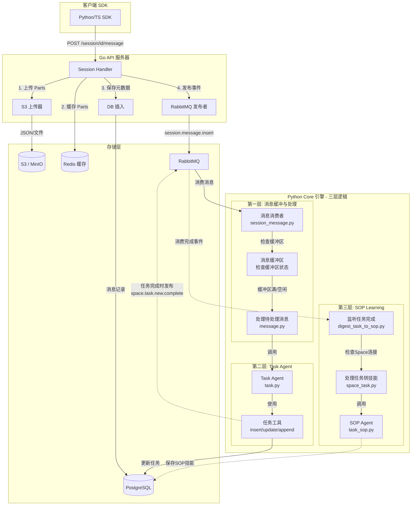
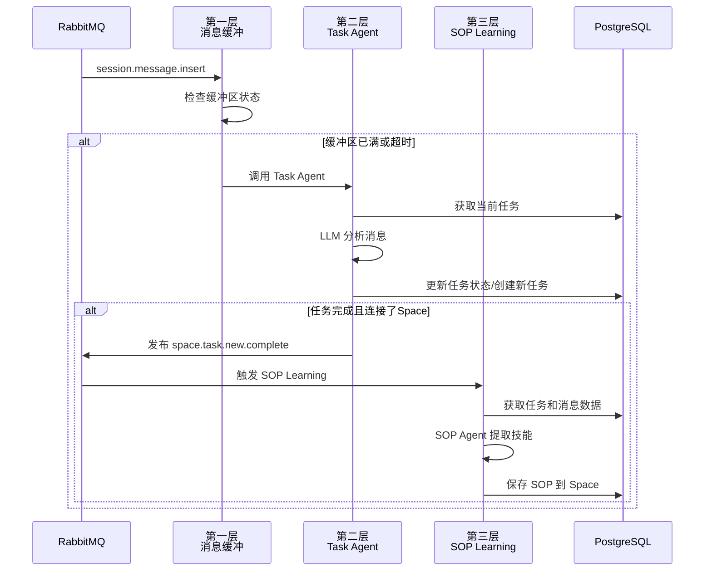
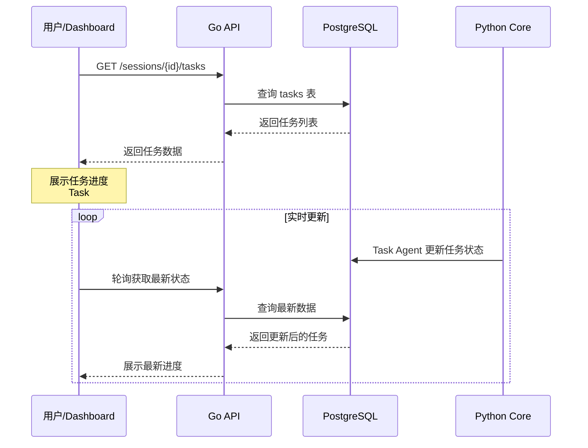
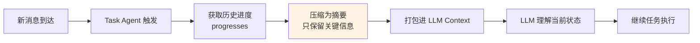
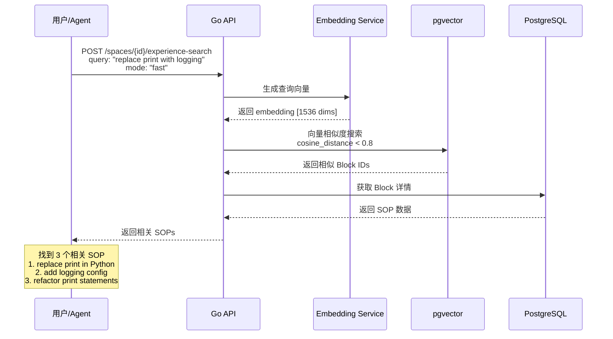
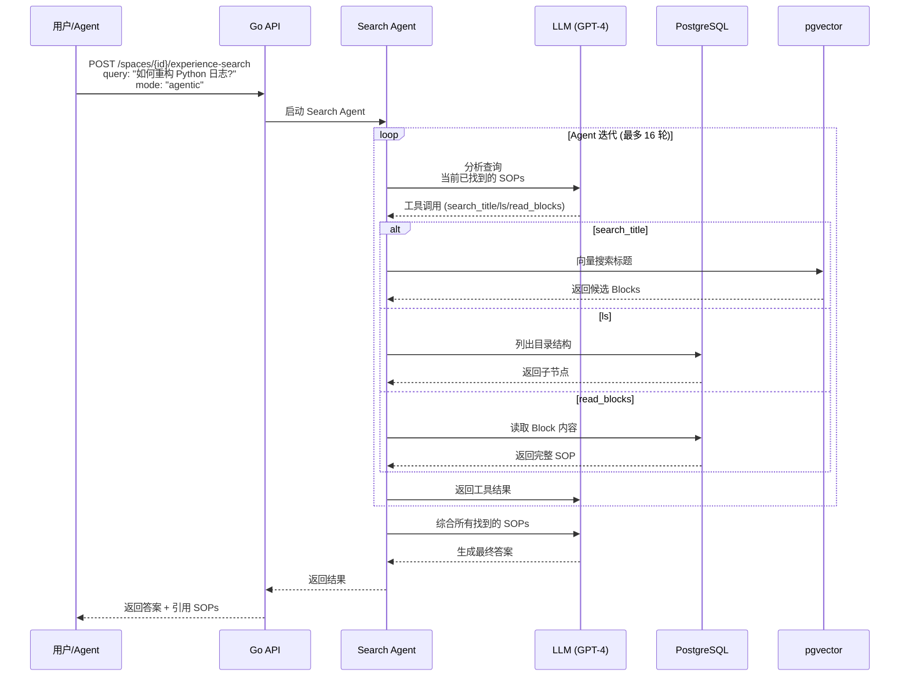
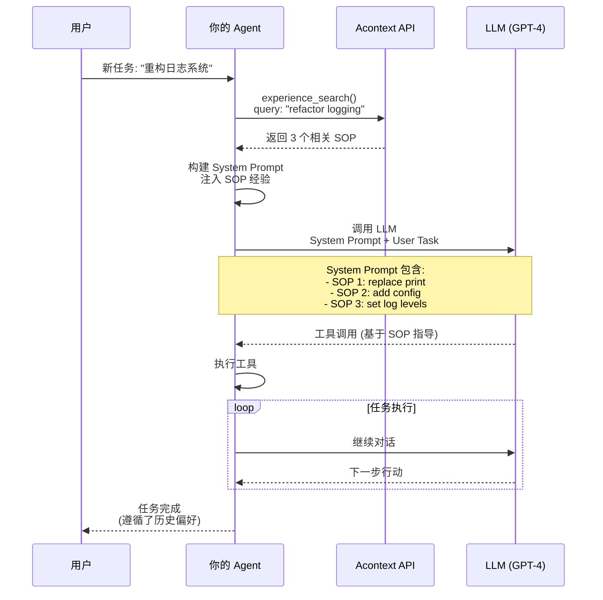
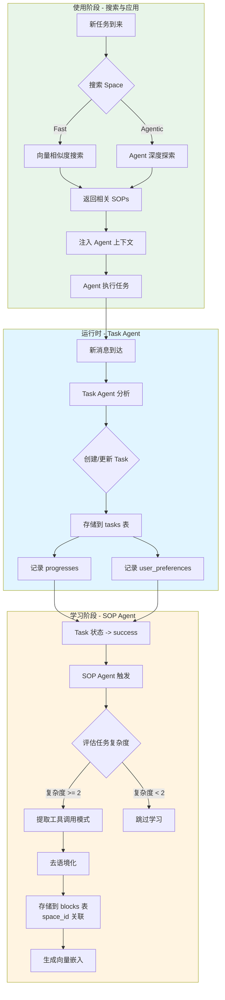

本指南解释了 Acontext 消息处理系统的内部架构,从初始 SDK 调用到后端处理和存储。

## 消息流概览

Acontext 使用解耦架构,API 服务器处理摄取和存储,而 Core 服务异步处理复杂的处理。



## 1. 通过 SDK 发送消息

用户主要通过 SDK 与系统交互。SDK 处理格式化消息有效负载(处理文本、文件、工具调用)并将其发送到 API。

### Python SDK 示例

```python
from acontext import AcontextClient
from acontext.messages import build_acontext_message

client = AcontextClient(api_key="...", base_url="...")

# 1. 创建会话
session = client.sessions.create(space_id="space-123")

# 2. 发送消息
# SDK 自动处理多部分消息和文件上传
message = client.sessions.send_message(
    session_id=session.id,
    blob=build_acontext_message(
        role="user",
        parts=["分析此数据", {"type": "file", "file_field": "data_file"}]
    ),
    format="acontext",
    file_field="data_file",
    file=("data.csv", b"col1,col2\n1,2", "text/csv")
)
```

<Note>
  有关完整的端到端示例,请参阅 `src/client/acontext-py/examples/basic_usage.py`。
</Note>

## 2. 后端处理逻辑

### 步骤 1:摄取 (Go API)

当 Go API 收到消息请求时:

1.  **资产上传**:如果有文件附件或消息内容复杂,部分将上传到 S3。
    *   来源:`src/server/api/go/internal/modules/service/session.go:225`
2.  **持久化**:消息元数据(包括 S3 引用)存储在 PostgreSQL 中。
    *   来源:`src/server/api/go/internal/modules/service/session.go:277`
3.  **缓存**:消息部分缓存在 Redis 中以便快速检索。
    *   来源:`src/server/api/go/internal/modules/service/session.go:257`
4.  **事件发布**:将事件发布到 RabbitMQ 以通知 Core 引擎。
    *   来源:`src/server/api/go/internal/modules/service/session.go:282`

### 步骤 2:缓冲和处理 (Python Core)

Python Core 引擎异步使用消息。它实现了智能缓冲机制以优化 LLM 上下文使用。

*   **缓冲**:消息不会立即逐个处理。相反,它们会被缓冲直到:
    *   缓冲区已满(配置的最大轮数)。
    *   或者会话变为空闲(达到超时)。
    *   来源:`src/server/core/acontext_core/service/session_message.py:41`

*   **处理**:一旦触发,`TaskAgent` 分析对话历史记录并更新会话任务。
    *   来源:`src/server/core/acontext_core/service/controller/message.py:12`

## 3. 树状结构历史记录

Acontext 支持分支对话,允许"重试"逻辑或探索不同的对话路径而不丢失原始上下文。

### 数据模型

PostgreSQL 中的 `Message` 模型使用 `parent_id` 邻接列表模式来表示此树结构。

```go src/server/api/go/internal/modules/model/message.go:22
type Message struct {
    ID        uuid.UUID  `gorm:"type:uuid;default:gen_random_uuid();primaryKey" json:"id"`
    SessionID uuid.UUID  `gorm:"type:uuid;not null;index" json:"session_id"`
    
    // ParentID 指向线程中的前一条消息。
    // 这允许无限分支。
    ParentID  *uuid.UUID `gorm:"type:uuid;index" json:"parent_id"`
    
    // ... 其他字段
}
```

### 分支如何工作

1.  **线性对话**:通常,每条新消息的 `parent_id` 指向紧接在前面的消息。
2.  **分支**:要创建分支(例如,编辑用户消息或重新生成助手响应),将创建一条新消息,指向与被"替换"的消息*相同*的 `parent_id`。

这种结构允许前端渲染对话树,并让代理向后遍历树以构建任何给定叶节点的上下文窗口。

## 4. Python Core 引擎的三层逻辑

Python Core 引擎是 Acontext 的大脑,负责异步处理复杂的逻辑。它采用**三层处理架构**,每一层都有明确的职责和触发时机。

### 第一层:消息缓冲与处理

**职责**:智能缓冲消息,优化 LLM 上下文使用

#### 缓冲机制

消息不会立即逐个处理,而是被缓冲直到满足以下任一条件:

1. **缓冲区已满**:达到配置的最大轮数(默认值可在 `config.yaml` 中设置)
2. **会话空闲**:在配置的超时时间内没有新消息到达

**源码位置**:
- [`session_message.py:41`](../src/server/core/acontext_core/service/session_message.py#L41) - `insert_new_message()` 消息消费者

#### 处理触发

一旦缓冲区触发,系统会:
1. 获取所有待处理消息(按时间排序)
2. 更新消息状态为 `RUNNING`
3. 调用 **Task Agent** 进行任务提取

**源码位置**:
- [`message.py:12`](../src/server/core/acontext_core/service/controller/message.py#L12) - `process_session_pending_message()`

---

### 第二层:Task Agent - 任务提取与跟踪

**职责**:从对话中自动提取任务、跟踪进度和用户偏好

#### Task Agent 的核心职责

Task Agent (`TaskPrompt`) 扮演"**项目经理**"的角色,主要职责包括:

1. **任务跟踪**:从用户和 Agent 的对话中识别并收集计划的任务或步骤
2. **消息匹配**:分析消息的上下文和内容,将其关联到现有的任务上
3. **状态更新**:根据任务的进度和完成信号,更新任务的状态(`pending`, `running`, `success`, `failed`)
4. **进度记录**:记录任务执行过程中的关键进展
5. **偏好收集**:捕获用户在任务执行中表达的偏好

#### 工作流程

**源码位置**:[`task.py:116`](../src/server/core/acontext_core/llm/agent/task.py#L116) - `task_agent_curd()`

Task Agent 是一个循环迭代的过程(默认最多 3 轮):

1. **构建上下文**:
   - 从数据库获取当前会话的所有任务
   - 打包任务列表、先前的进度摘要和当前需要分析的消息
   - 构建 Prompt,包含上述信息以及工具定义

2. **LLM 分析与工具调用**:
   - 调用 LLM,让其分析当前情况并决定采取的行动
   - LLM 可以使用的工具包括:
     - `insert_task`:创建新任务
     - `update_task`:修改现有任务状态
     - `append_messages_to_task`:将消息关联到任务,并记录进度
     - `append_messages_to_planning_section`:记录计划阶段的讨论
     - `report_thinking`:输出思考过程(CoT)
     - `finish`:结束当前处理循环

3. **执行与更新**:
   - 执行 LLM 选择的工具,更新数据库中的任务状态和消息关联
   - 将工具的执行结果反馈给 LLM,进行下一轮迭代

#### 关键逻辑细节

- **计划检测**:Task Agent 会特别关注讨论"下一步做什么"的消息,并将它们归类为计划部分,而不是具体的任务执行
- **任务粒度**:Agent 被指示保持适当的任务粒度(通常 3-10 个顶层任务),避免创建过多琐碎的子任务
- **状态流转**:
  - `pending` -> `running`:当任务开始执行或重试时
  - `running` -> `success`:当任务确认完成且无错误时
  - `running` -> `failed`:当发生明确错误或用户放弃任务时
  - `failed` -> `running`:当用户或 Agent 尝试修复失败的任务时

---

### 第三层:SOP Learning - 技能学习

**职责**:从成功完成的任务中提取可复用的操作步骤(SOP),并保存到 Space 知识库

#### 学习触发机制

当任务状态变为 `success` 时,系统会自动触发 SOP 学习流程。这个过程是异步的,不会阻塞主流程。

**源码位置**:
- [`digest_task_to_sop.py:20`](../src/server/core/acontext_core/service/digest_task_to_sop.py#L20) - `space_complete_new_task()`

#### SOP Agent 工作流程

**源码位置**:[`task_sop.py:51`](../src/server/core/acontext_core/llm/agent/task_sop.py#L51) - `sop_agent_curd()`

SOP Agent 扮演"**复盘专家**"的角色:

1. **打包任务数据**:提取任务描述、用户偏好和原始消息
2. **应用自定义规则**:如果配置了评分标准,则用于控制何种任务值得学习
3. **LLM 分析与 SOP 提取**:
   - 调用 LLM 分析任务执行过程
   - 识别关键的工具调用序列
   - 提取"何时使用"的触发条件
   - 记录用户偏好
   - 最终通过 `submit_sop` 工具将 SOP 保存到 Space

#### 学习优化

- **智能过滤**:不是所有任务都会被学习,系统会评估任务的复杂度和价值
- **用户确认**:如果配置了用户确认选项,新的 SOP 需要用户确认后才会生效
- **去重机制**:避免学习重复或过于相似的 SOP

---

### 三层逻辑的协作关系



通过这种三层架构,Acontext 能够:
1. **高效处理**:批量处理消息,减少 LLM 调用次数
2. **自动跟踪**:实时监控任务进度,无需人工维护
3. **持续学习**:从成功案例中自动提取可复用的知识

<Note>
  更多技术细节请参考:
  - [Task Agent 深度剖析](./task-agent-deep-dive.md)
  - [SOP Learning 深度剖析](./sop-learning-deep-dive.md)
  - [技能搜索深度剖析](./skill-search-deep-dive.md)
</Note>

---

### Task Agent vs SOP Learning 的核心区别

在深入了解三层架构之前，首先理解 Task Agent 和 SOP Learning 的根本区别非常重要：

| 特性 | **Task Agent (任务代理)** | **SOP Learning (技能学习)** |
| :--- | :--- | :--- |
| **角色定位** | 🎯 **项目经理**<br>负责盯着当下的活儿干完 | 📚 **复盘专家**<br>负责在项目成功后总结经验写成手册 |
| **执行时机** | **运行时 (Runtime)**<br>每当有新消息且缓冲区触发时执行 | **事后 (Post-mortem)**<br>仅在任务状态变为 `SUCCESS` 后异步触发 |
| **核心目标** | **跟踪进度**<br>维护动态的任务清单，确保任务状态准确 | **提炼知识**<br>从具体案例中抽象出通用的操作流程 |
| **处理对象** | **具体的任务实例**<br>例："把 `main.py` 的 `print` 改成 `logging`" | **通用的技能模式**<br>例："如何进行代码重构" |
| **关注问题** | **"现在发生了什么？"**<br>用户说了啥？属于哪个任务？任务完成了吗？ | **"我们学到了什么？"**<br>用了什么工具？顺序是什么？触发条件是什么？ |
| **数据流向** | 写入 **Session (会话表)**<br>更新任务状态、进度条、消息关联 | 写入 **Space (知识库)**<br>创建新的 SOP 技能块 |
| **工具使用** | `insert_task`, `update_task`,<br>`append_messages_to_task` | `submit_sop` (提交提炼后的 SOP) |
| **源码位置** | [`task.py:116`](../src/server/core/acontext_core/llm/agent/task.py#L116) | [`task_sop.py:51`](../src/server/core/acontext_core/llm/agent/task_sop.py#L51) |

#### 实例对比：重构代码的场景

假设用户说：*"帮我把 `main.py` 里的 `print` 换成 `logging`"*

**Task Agent 会做：**
1. 创建一个任务：`Task #1: Refactor print to logging in main.py`
2. 状态流转：`PENDING` -> `RUNNING`
3. 进度记录：
   - `"Opened main.py"`
   - `"Found 3 print statements"`
   - `"Replaced with logging calls"`
   - `"Saved file"`
4. 最终状态：`SUCCESS`

**SOP Learning 会做（在任务成功后）：**
1. 分析整个任务的工具调用序列
2. 去语境化（忽略具体文件名和内容）
3. 生成一个可复用的 SOP 存入 Space 知识库

下次如果有另一个用户说*"把 `utils.py` 的 `print` 删了"*，Agent 就能通过搜索 Space 找到这个 SOP，知道应该先读文件、再搜索、最后替换，而不需要从头摸索。

---

## 5. Task Agent 抽取和存储的内容

### Task 数据结构

**数据模型位置**: [`task.go:10`](../src/server/api/go/internal/modules/model/task.go#L10) (Go), [`task.py:21`](../src/server/core/acontext_core/schema/session/task.py#L21) (Python)

```python
class TaskData:
    task_description: str                    # 任务描述
    progresses: list[str] | None             # 进度记录列表
    user_preferences: list[str] | None       # 用户偏好列表
    sop_thinking: str | None                 # 内部思考(未使用)

class Task:
    id: UUID
    session_id: UUID
    order: int                               # 任务顺序 (1, 2, 3, ...)
    status: "pending" | "running" | "success" | "failed"
    data: TaskData
    space_digested: bool                     # 是否已被 SOP Agent 处理
    raw_message_ids: list[UUID]              # 关联的消息 ID
```

### 具体示例

**场景**: 用户说 *"帮我把项目的所有 `print` 语句替换为 `logging`"*

**Task Agent 会抽取并存储:**

```json
{
  "id": "550e8400-e29b-41d4-a716-446655440001",
  "session_id": "550e8400-e29b-41d4-a716-446655440000",
  "order": 1,
  "status": "success",
  "data": {
    "task_description": "Replace all print statements with logging in the project",
    "progresses": [
      "I navigated to the project directory",
      "I found 15 print statements across 3 files: main.py, utils.py, helpers.py",
      "I replaced all print() calls with logging.info() in main.py",
      "I added logging configuration at the top of each file",
      "I tested the changes and confirmed logging works correctly"
    ],
    "user_preferences": [
      "user wants to use logging.info level by default",
      "user expects to see timestamps in log output"
    ]
  },
  "space_digested": false,
  "raw_message_ids": [
    "msg-001", "msg-002", "msg-003", "msg-004", "msg-005"
  ]
}
```

### 关键特点

- **进度记录 (`progresses`)**: 以第一人称记录任务执行过程中的关键事件,包含**具体值**(文件名、数量、错误信息等)
- **用户偏好 (`user_preferences`)**: 捕获用户在任务执行中表达的偏好和个人信息
- **消息关联 (`raw_message_ids`)**: 跟踪哪些消息贡献了这个任务的进度

---

## 6. SOP Agent 抽取和存储的内容

### Skill (技能) 的本质

在 Acontext 中，**Skill (技能) 等同于 SOP (标准作业程序)**。它不仅仅是数据的记录，而是一种 **"可执行的知识" (Executable Knowledge)**。

SOP Agent 抽取和生成的数据包含三个核心要素：

1.  **触发条件 (Contextual Trigger)**: 描述了该技能适用的具体场景（`use_when`）。
    *   *例："当需要在 Python 项目中替换 print 为 logging 时"*
2.  **抽象行动序列 (Abstracted Action Sequence)**: 一组去除了具体参数（如特定文件名、ID）的标准工具调用步骤（`tool_sops`）。
    *   *例：`list_files` -> `search` -> `replace` (而不是 "打开 main.py 修改第 10 行")*
3.  **约束与偏好 (Constraints & Preferences)**: 执行该技能时需要遵守的通用规则（`preferences`）。
    *   *例："总是使用 logging.info 而不是 print"*

### 生成机制：复杂度评分

SOP Agent 并不是对所有完成的任务都生成 Skill。在 [`task_sop.py`](../src/server/core/acontext_core/llm/agent/task_sop.py) 中，它会先对任务进行**复杂度评分**：

*   **简单任务 (Score < 2)**: 直接跳过，不生成 Skill。
*   **复杂任务 (Score >= 2)**: 提取 SOP。
    *   **加分项**:
        *   出现过因参数错误导致的报错 (+1)
        *   出现过策略错误导致的回退 (+1)
        *   用户提供了纠正反馈 (+2)
        *   用户强调了特定偏好 (+2)

这种机制确保了 Acontext 只学习那些**"值得学习"**的经验（即那些容易出错、有挑战性或包含用户特定偏好的任务）。

### SOP 数据结构

**数据模型位置**: [`sop_block.py:6`](../src/server/core/acontext_core/schema/block/sop_block.py#L6)

```python
class SOPStep:
    tool_name: str      # 工具名称(必须是历史中实际使用过的)
    action: str         # 使用该工具做什么(去除了具体参数值)

class SOPData:
    use_when: str                    # 触发条件(3-5个词,带上下文)
    preferences: str                 # 用户偏好(已去除会变化的信息)
    tool_sops: list[SOPStep]         # 工具调用步骤序列

class SOPBlock(SOPData):
    id: UUID
    space_id: UUID                   # 所属 Space
```

### 具体示例 1：代码重构

**基于上面的 Task,SOP Agent 会生成:**

```json
{
  "id": "sop-001",
  "space_id": "space-123",
  "use_when": "replace print with logging in Python projects",
  "preferences": "use logging.info level, include timestamps",
  "tool_sops": [
    {
      "tool_name": "list_files",
      "action": "find all Python files in the project directory"
    },
    {
      "tool_name": "search_in_file",
      "action": "search for print() statements in each file"
    },
    {
      "tool_name": "replace_in_file",
      "action": "replace print() with logging.info() calls"
    },
    {
      "tool_name": "write_file",
      "action": "add logging configuration import at file top if not exists"
    },
    {
      "tool_name": "execute_command",
      "action": "run tests to verify logging works"
    }
  ]
}
```

### 具体示例 2：Git 操作

**场景**: 用户说 *"把 feat-login 分支推送到 origin，如果不存在就创建"*

**Task Agent 记录**:
- 执行了 `git push` -> 失败 (no upstream)
- 执行了 `git push --set-upstream origin feat-login` -> 成功

**SOP Agent 提取的 Skill**:

```json
{
  "use_when": "push a new local branch to remote git",
  "preferences": "",
  "tool_sops": [
    {
      "tool_name": "execute_command",
      "action": "try git push first"
    },
    {
      "tool_name": "execute_command",
      "action": "if failed, use git push --set-upstream origin <branch_name>"
    }
  ]
}
```

### 关键特点

- **去语境化**: 移除了具体的文件名(`main.py` -> "each file")、分支名(`feat-login` -> `<branch_name>`)
- **保留条件**: `use_when` 包含了关键上下文("in Python projects", "new local branch")
- **最短路径**: 只保留必要步骤,省略了冗余操作
- **通用化偏好**: 只保留对未来执行有指导意义的偏好

---

## 7. 数据使用场景

### Task 数据的使用

#### 使用场景 1: 实时进度跟踪

**API 端点**: `GET /api/v1/sessions/{session_id}/tasks`

**完整流程**:



**SDK 使用示例**:

```python
from acontext import AcontextClient

client = AcontextClient(...)
tasks = client.sessions.get_tasks(session_id)

for task in tasks.items:
    print(f"Task #{task.order}: {task.data.task_description}")
    print(f"Status: {task.status}")
    if task.data.progresses:
        print("Progress:")
        for progress in task.data.progresses:
            print(f"  - {progress}")
```

**使用价值**:
- ✅ 在 Dashboard 中展示任务进度
- ✅ 为用户提供实时状态更新
- ✅ 用于统计任务成功率指标
- ✅ 监控 Agent 执行情况,及时发现卡顿或失败

---

#### 使用场景 2: 上下文压缩

**源码位置**: [`task.py:29`](../src/server/core/acontext_core/llm/agent/task.py#L29) - `pack_previous_progress_section()`

**流程说明**:



Task Agent 会将之前的进度打包成摘要,减少 LLM 上下文长度:

```
## Previous Progress:
Task 1: I found 15 print statements across 3 files
Task 1: I replaced all print() calls with logging.info()
Task 2: I added error handling to the API endpoints
```

这样后续的 LLM 调用不需要重新读取所有历史消息，**节省 Token 成本并提高处理速度**。

**使用价值**:
- ✅ 减少 LLM 上下文长度 (可节省 50-80% 的 Token)
- ✅ 加快 Agent 响应速度
- ✅ 保持历史连贯性的同时优化成本

---

### SOP 数据的使用

#### 使用场景 1: 快速搜索 (Fast Mode)

**API 端点**: `POST /api/v1/spaces/{space_id}/experience-search`

**源码位置**: [`block_search.py:17`](../src/server/core/acontext_core/service/data/block_search.py#L17) - `search_blocks()`

**完整流程**:



**SDK 使用示例**:

```python
# 用户新任务: "帮我把 utils.py 的 print 改成 logging"
result = client.spaces.experience_search(
    space_id=space.id,
    query="replace print with logging",
    mode="fast",  # 使用向量嵌入快速匹配
    limit=5
)

# 返回相关的 SOP blocks
for block in result.cited_blocks:
    print(f"Found SOP: {block.data['use_when']}")
    print(f"Steps: {len(block.data['tool_sops'])} tools")
```

**技术实现**:
1. 将查询文本生成向量嵌入 (OpenAI `text-embedding-3-small`)
2. 使用 pgvector 的余弦距离搜索相似 SOP
3. 返回最相似的 SOP blocks (默认阈值: cosine_distance < 0.8)

**使用价值**:
- ✅ **速度快**: 毫秒级响应
- ✅ **成本低**: 只需要一次嵌入调用
- ✅ **适合简单查询**: 如直接关键词匹配

---

#### 使用场景 2: Agent 深度搜索 (Agentic Mode)

**源码位置**: [`space_search.py:30`](../src/server/core/acontext_core/llm/agent/space_search.py#L30) - `space_agent_search()`

**完整流程**:



**SDK 使用示例**:

```python
result = client.spaces.experience_search(
    space_id=space.id,
    query="How to refactor Python code to use logging?",
    mode="agentic",  # 使用 Agent 深度探索
    max_iterations=20
)

# Agent 会:
# 1. 遍历 Space 的目录结构
# 2. 读取相关的 page 和 folder
# 3. 收集多个相关的 SOP
# 4. 综合生成最终答案
print(result.final_answer)
```

**技术实现**:
1. Search Agent 使用工具组合导航 Space:
   - `search_title` - 向量搜索标题
   - `search_content` - 向量搜索内容
   - `ls` - 列出目录
   - `read_blocks` - 读取 Block 详情
2. LLM 智能决策下一步行动
3. 收集所有相关的 SOP blocks
4. 可选: 生成综合性的答案

**使用价值**:
- ✅ **智能性强**: 可以理解复杂查询
- ✅ **覆盖全面**: 可以找到多个相关 SOP 组合
- ✅ **适合复杂查询**: 如"如何优化性能?"需要多个技能配合

**对比: Fast vs Agentic**

| 特性 | Fast Mode | Agentic Mode |
|------|-----------|--------------|
| **速度** | 毫秒级 (1 次嵌入 + 1 次查询) | 秒级 (多次 LLM 调用) |
| **成本** | 低 (只有嵌入成本) | 中等 (LLM 迭代成本) |
| **精度** | 适合直接匹配 | 适合复杂理解 |
| **用例** | "替换 print" | "如何重构日志系统?" |

---

#### 使用场景 3: Agent 决策时的上下文增强

**完整流程**:



在新 Session 开始时,Agent 可以查询相关 SOP 来指导决策:

```python
# 创建新 Session 并连接到 Space
session = client.sessions.create(space_id=space.id)

# Agent 收到用户任务后,先搜索相关经验
user_message = "帮我重构这个项目的日志系统"
relevant_sops = client.spaces.experience_search(
    space_id=space.id,
    query=user_message,
    mode="fast"
)

# 将 SOP 注入到 Agent 的 system prompt 中
system_prompt = f"""
You are a coding assistant.

## Relevant Past Experiences:
{format_sops(relevant_sops.cited_blocks)}

Use the above experiences as reference when completing the task.
"""
```

**使用价值**:
- ✅ Agent 不需要从头摸索,可以复用之前的成功经验
- ✅ 减少错误尝试和回退次数 (可减少 30-50% 的失败率)
- ✅ 保持用户偏好的一致性 (例如,用户总是喜欢用 `logging.info` 而不是 `logging.debug`)
- ✅ 提高任务成功率和用户满意度

---

## 8. 数据流转全景图



---

## 9. 完整实例:从任务到技能到应用

### 第一次执行:用户 A 的任务

用户 A 说:*"帮我把 `main.py` 里的 `print` 换成 `logging`"*

#### Task Agent 的工作:

创建并跟踪任务:

```json
{
  "order": 1,
  "status": "success",
  "data": {
    "task_description": "Replace print with logging in main.py",
    "progresses": [
      "I opened main.py and found 3 print statements at lines 10, 25, 42",
      "I replaced print('Starting...') with logging.info('Starting...')",
      "I replaced print(f'Processing {item}') with logging.info(f'Processing {item}')",
      "I replaced print(f'Error: {e}') with logging.error(f'Error: {e}')",
      "I added 'import logging' at line 1",
      "I configured logging with timestamp format",
      "I saved the file and ran tests successfully"
    ],
    "user_preferences": [
      "user wants info-level messages for normal flow",
      "user wants error-level for exceptions",
      "user wants timestamps in format: YYYY-MM-DD HH:MM:SS"
    ]
  }
}
```

#### SOP Agent 的工作:

任务成功后,提取可复用的 SOP:

```json
{
  "use_when": "replace print with logging in Python files",
  "preferences": "use logging.info for info, logging.error for errors, include timestamps",
  "tool_sops": [
    {"tool_name": "read_file", "action": "read target Python file"},
    {"tool_name": "search_pattern", "action": "find all print() calls and their contexts"},
    {"tool_name": "replace_text", "action": "replace with appropriate logging level based on context"},
    {"tool_name": "insert_line", "action": "add 'import logging' if not exists"},
    {"tool_name": "insert_line", "action": "add logging.basicConfig with timestamp format"},
    {"tool_name": "write_file", "action": "save modified file"},
    {"tool_name": "execute_command", "action": "run tests to verify"}
  ]
}
```

### 第二次执行:用户 B 的类似任务

用户 B 说:*"把 `utils.py` 的 `print` 删了,改成 logging"*

#### Agent 搜索 Space:

```python
sops = client.spaces.experience_search(
    space_id=space.id,
    query="把 print 改成 logging",
    mode="fast"
)
# 找到了用户 A 任务生成的 SOP!
```

#### Agent 使用 SOP 执行:

```
Agent 的 System Prompt 包含:
---
## Relevant Experience:
When you need to: replace print with logging in Python files

Follow these steps:
1. read_file: read target Python file
2. search_pattern: find all print() calls and their contexts
3. replace_text: replace with appropriate logging level based on context
4. insert_line: add 'import logging' if not exists
5. insert_line: add logging.basicConfig with timestamp format
6. write_file: save modified file
7. execute_command: run tests to verify

User Preferences:
- use logging.info for info messages
- use logging.error for errors
- include timestamps in format YYYY-MM-DD HH:MM:SS
---
```

#### 结果对比:

| 维度 | 用户 A (第一次) | 用户 B (有 SOP) |
|------|----------------|-----------------|
| **尝试次数** | 可能需要多次尝试找对 logging 级别 | 直接使用正确的级别 |
| **工具调用数** | ~15 次(包括回退和重试) | ~7 次(按 SOP 执行) |
| **任务时长** | 约 2 分钟 | 约 30 秒 |
| **错误率** | 可能忘记添加 import 或配置 | 按 SOP 清单执行,零遗漏 |
| **用户满意度** | 完成了,但可能需要多次确认 | 一次到位,符合偏好 |

**关键价值**: Agent 从第一次的"摸索"中学习,在第二次时已经"老练"了! 🎯

<Note>
  更多关于如何优化 SOP 学习和搜索的技术细节,请参考:
  - [SOP Learning 深度剖析](./sop-learning-deep-dive.md)
  - [技能搜索深度剖析](./skill-search-deep-dive.md)
</Note>