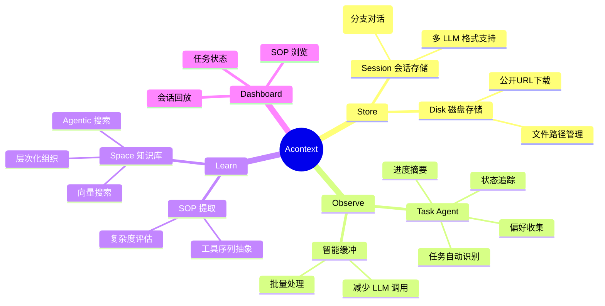
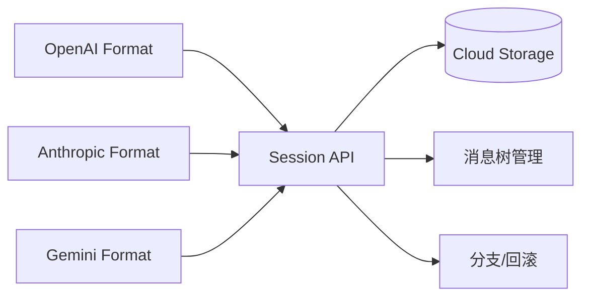

# Agent Context 云服务设计规格

## 1. Acontext 核心能力分析

### 1.1 架构概览


### 1.2 核心功能模块



### 1.3 核心数据流

```
┌─────────┐    ┌───────────┐    ┌────────────┐    ┌─────────────┐
│ Message │───►│ Task Agent│───►│ SOP Agent  │───►│ Space Store │
│ 消息流入 │    │ 任务提取   │    │ 技能提炼   │    │ 知识沉淀    │
└─────────┘    └───────────┘    └────────────┘    └─────────────┘
                    │                                    │
                    ▼                                    ▼
              ┌───────────┐                      ┌─────────────┐
              │ Dashboard │◄─────────────────────│ Experience  │
              │ 可视化     │                      │ Search      │
              └───────────┘                      └─────────────┘
```

### 1.4 关键设计要点

| 模块 | 设计要点 | 价值 |
|------|----------|------|
| **消息存储** | 树形结构(parent_id)、S3 大对象 | 支持分支对话、低成本存储 |
| **Task 观察** | 非侵入式、状态机模式、证据链 | 无需 Agent 特殊格式化 |
| **智能缓冲** | 2 条消息 or 10s 超时触发 | LLM 调用减少 50-80% |
| **SOP 学习** | 复杂度 ≥2 才学习、去语境化 | 只学有价值的、可复用 |
| **Space 搜索** | Fast(向量) + Agentic(LLM 导航) | 简单查询快、复杂查询准 |

---

## 2. Agent Context 云服务功能设计

### 2.1 功能全景图

```mermaid
mindmap
  root((Agent Context<br/>云服务))
    降低 TCO
      开发提效
        P0 统一 Session 存储
        P0 即插即用 SDK
        P1 主流框架无感接入
        P1 可视化 Dashboard
        P1 Context 操作
        P2 Prompt 模板市场
        P2 Built-in Tool
        P1 任务状态/监控告警
      Token 优化
        P1 SOP 复用
        P1 上下文压缩
        P2 智能缓冲
    提升效果
      P1 SOP 提取与应用
      P1 用户偏好积累
      P2 SOP/Skill 市场
```



### 2.2 功能详细设计

#### 2.2.1 降低 TCO - 开发提效

##### P0: 统一 Session 存储

**目标**: 开发者无需自建消息存储，一套 API 管理所有对话历史



**核心能力**:
- 多 LLM 消息格式统一适配
- 消息树结构：支持 retry、edit、branch
- 元数据关联：tool_call_id、图片、文件
- 自动持久化 + 按需加载

---

##### P0: 即插即用 SDK

**目标**: 3 行代码完成接入

```python
# Python 示例
from agent_context import AgentContext
ctx = AgentContext(api_key="xxx")
session = ctx.session.create()
```

```typescript
// TypeScript 示例
import { AgentContext } from '@agent-context/sdk';
const ctx = new AgentContext({ apiKey: 'xxx' });
const session = await ctx.session.create();
```

**核心能力**:
- Python / TypeScript 双语言
- 同步 + 异步 API
- 自动重试、断线重连
- 本地开发模式（Mock）

---

##### P1: 主流框架无感接入

**目标**: 现有 Agent 代码零改动或极少改动即可接入

| 框架 | 接入方式 | 复杂度 |
|------|----------|--------|
| LangGraph | Checkpointer 接口实现 | 低 |
| OpenAI Agent SDK | Middleware 注入 | 低 |
| LangChain | Memory 接口实现 | 中 |
| AutoGen | 自定义 Agent 包装 | 中 |

```python
# LangGraph 示例
from agent_context.integrations import AgentContextCheckpointer
graph = StateGraph(...)
graph.compile(checkpointer=AgentContextCheckpointer(session_id="xxx"))
```

---

##### P1: 可视化 Dashboard

**目标**: 免写调试工具，实时观察 Agent 运行状态

```
┌─────────────────────────────────────────────────────────┐
│  Dashboard                                              │
├─────────────┬───────────────────────────────────────────┤
│ Sessions    │  Session Detail                           │
│ ├─ #a1b2c3  │  ┌─────────────────────────────────────┐ │
│ ├─ #d4e5f6  │  │ Message Timeline                    │ │
│ └─ #g7h8i9  │  │ [User] 帮我查询订单                 │ │
│             │  │ [Assistant] 好的，正在查询...       │ │
│ Tasks       │  │ [Tool] query_order({id: 123})       │ │
│ ├─ Running  │  └─────────────────────────────────────┘ │
│ └─ Done     │  ┌─────────────────────────────────────┐ │
│             │  │ Task Status                         │ │
│ Metrics     │  │ ✓ 理解用户意图                      │ │
│ ├─ Tokens   │  │ ● 执行订单查询                      │ │
│ └─ Latency  │  │ ○ 返回结果                          │ │
│             │  └─────────────────────────────────────┘ │
└─────────────┴───────────────────────────────────────────┘
```

**核心能力**:
- Session 列表与消息时间线
- 任务状态实时展示
- Token 消耗统计
- 错误日志与追踪

---

##### P1: Context 操作

**目标**: 一套 API 完成上下文工程的常见操作

| 操作 | 说明 | 用途 |
|------|------|------|
| **Compress** | 压缩历史消息为摘要 | 长对话 Token 优化 |
| **Checkpoint** | 保存当前状态快照 | 断点恢复、回滚 |
| **Clone** | 复制 Session | A/B 测试、并行探索 |
| **Branch** | 从某消息分叉 | 多路径尝试 |
| **Window** | 滑动窗口截取 | 控制上下文长度 |

```python
# Compress: 压缩前 N 条消息
ctx.session.compress(session_id, keep_last=5)

# Checkpoint: 保存快照
cp_id = ctx.session.checkpoint(session_id)
ctx.session.restore(session_id, checkpoint_id=cp_id)

# Branch: 从消息 M 分叉
new_session = ctx.session.branch(session_id, from_message_id="msg_xxx")
```

---

##### P1: 任务状态与监控告警

**目标**: 自动追踪 Agent 任务进度，异常时告警


**核心能力**:
- Task 自动识别与状态追踪（同 Acontext）
- 成功率/失败率统计
- 自定义告警规则
- Webhook / Email 通知

---

##### P2: Prompt 模板市场

**目标**: 提供高质量系统 Prompt 模板

**分类**:
- 编程助手（Code Agent）
- 数据分析（Data Agent）
- 客服对话（Support Agent）
- 浏览器操作（Browser Agent）

---

##### P2: Built-in Tool

**目标**: 常用工具标准定义，减少重复编写

```python
from agent_context.tools import web_search, code_executor, file_manager

tools = [web_search, code_executor, file_manager]
```

---

#### 2.2.2 降低 TCO - Token 优化

##### P1: SOP 复用

**目标**: 相同/相似任务复用历史成功路径，避免重复试错


**预期收益**: 相同任务 Token 减少 30-60%

---

##### P1: 上下文压缩

**目标**: 智能压缩历史消息，保留关键信息

| 策略 | 说明 | 适用场景 |
|------|------|----------|
| **摘要压缩** | LLM 生成历史摘要 | 长对话 |
| **选择性保留** | 只保留关键消息 | 多轮闲聊后 |
| **分层存储** | L1 完整/L2 摘要/L3 SOP | 超长会话 |

---

##### P2: 智能缓冲

**目标**: 消息批处理，减少 Task Agent 调用次数

```
消息1 ──┐
消息2 ──┼──► 缓冲区 ──► 批量处理 ──► Task Agent
消息3 ──┘
       (2条 or 10s 触发)
```

**预期收益**: Task Agent 调用减少 50-80%

---

#### 2.2.3 提升 Agent 效果

##### P1: SOP 提取与应用

**目标**: 从成功任务自动提炼可复用技能


**SOP 结构**:
```json
{
  "use_when": "何时使用",
  "preferences": "用户偏好",
  "tool_sops": [
    {"tool_name": "goto", "action": "导航到目标页面"},
    {"tool_name": "click", "action": "点击目标按钮"}
  ]
}
```

**效果**:
- 减少步骤：直接走正确路径
- 提升成功率：复用验证过的方法
- 效果更优：融合用户偏好

---

##### P1: 用户偏好积累

**目标**: 记住用户约束，个性化 Agent 行为

```
Session 1: 用户说 "我喜欢用 Outlook"
    ↓ 提取偏好
Session 2: Agent 自动用 Outlook 登录
```

**偏好类型**:
- 工具偏好：使用特定工具/服务
- 风格偏好：输出格式、语气
- 约束偏好：禁止某些操作

---

##### P2: SOP/Skill 市场

**目标**: 共享和复用社区沉淀的高质量 SOP

```
┌─────────────────────────────────────┐
│  Skill Market                       │
├─────────────────────────────────────┤
│ Categories:                         │
│  ├─ GitHub Operations      [120]    │
│  ├─ Database Queries       [85]     │
│  ├─ API Integration        [67]     │
│  └─ Browser Automation     [203]    │
├─────────────────────────────────────┤
│ Top Skills:                         │
│  ★★★★★ Star GitHub Repo   (2.3k uses)│
│  ★★★★☆ Query PostgreSQL   (1.8k uses)│
│  ★★★★☆ Send Email         (1.5k uses)│
└─────────────────────────────────────┘
```

---

### 2.3 优先级汇总

| 优先级 | 功能 | 核心价值 |
|--------|------|----------|
| **P0** | 统一 Session 存储 | 基础能力，必须有 |
| **P0** | 即插即用 SDK | 开发者入口 |
| **P1** | 主流框架无感接入 | 降低迁移成本 |
| **P1** | 可视化 Dashboard | 调试/运维必备 |
| **P1** | Context 操作 | 核心差异化 |
| **P1** | 任务状态/监控 | 可观测性 |
| **P1** | SOP 提取与应用 | 效果提升核心 |
| **P1** | 上下文压缩 | Token 优化核心 |
| **P1** | 用户偏好积累 | 个性化 |
| **P2** | Prompt 模板市场 | 生态扩展 |
| **P2** | Built-in Tool | 开发便利 |
| **P2** | 智能缓冲 | Token 优化增强 |
| **P2** | SOP/Skill 市场 | 社区生态 |

---

## 3. 云服务架构

### 3.1 整体架构


### 3.2 数据模型


### 3.3 关键流程

#### 消息存储与任务提取


#### SOP 学习与应用


### 3.4 部署架构


### 3.5 扩展性设计

| 维度 | 策略 |
|------|------|
| **水平扩展** | API/Core 无状态，按需扩容 |
| **存储扩展** | PostgreSQL 分库分表 + OBS 无限扩展 |
| **消息队列** | 按 session_id 分区，并行消费 |
| **LLM 调用** | 异步队列 + 限流 + 重试 |
| **多租户** | Project 隔离 + 配额管理 |

---

## 4. 下一步

1. **MVP 范围确定**: P0 + 核心 P1 功能
2. **API 设计**: RESTful API 规格定义
3. **SDK 设计**: Python/TS SDK 接口设计
4. **原型开发**: 核心流程验证
