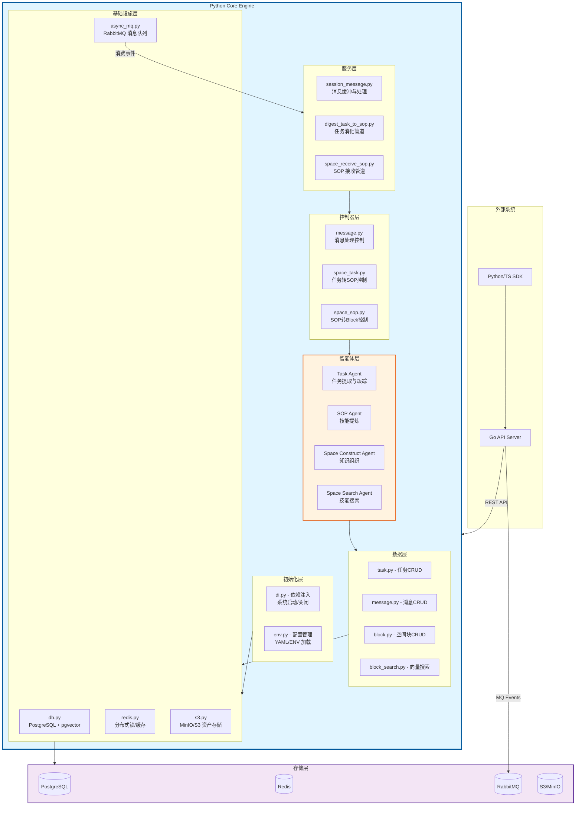
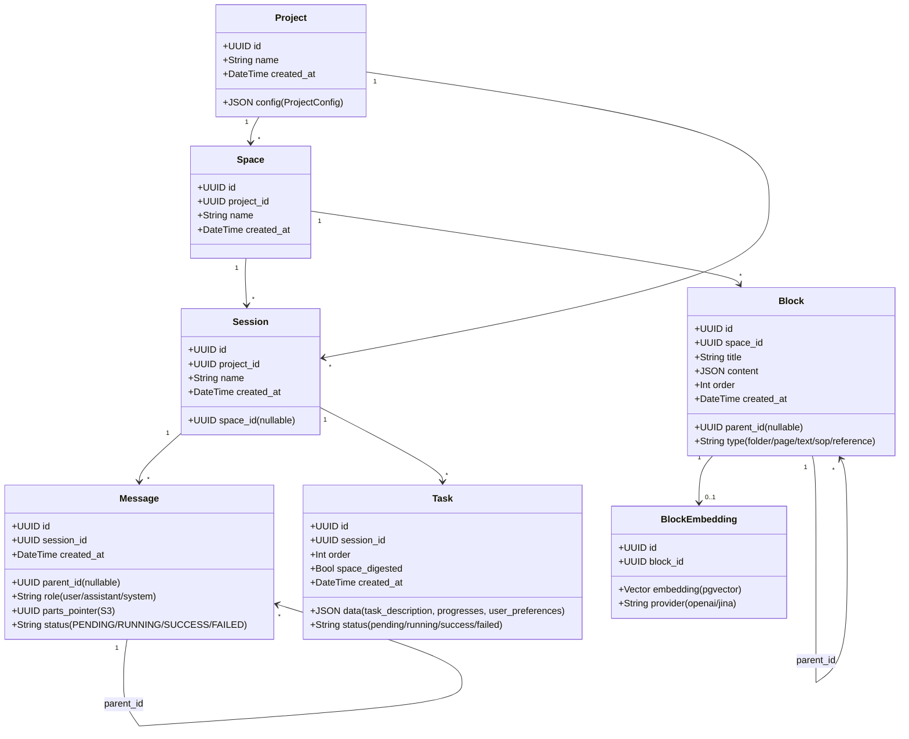
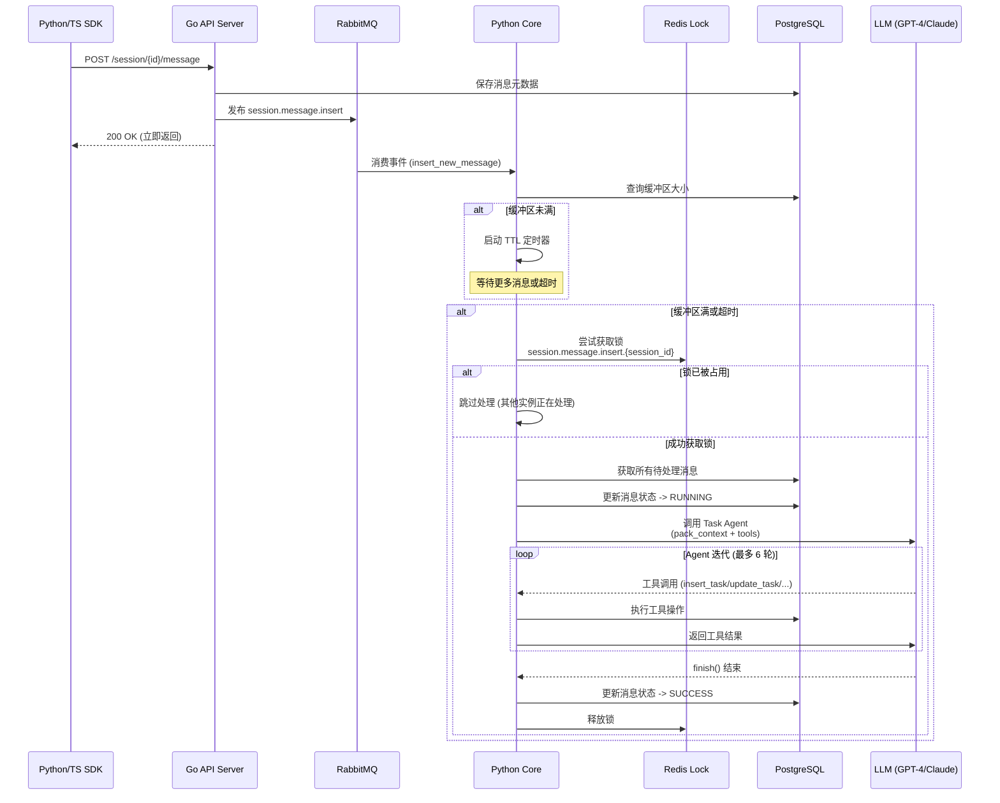
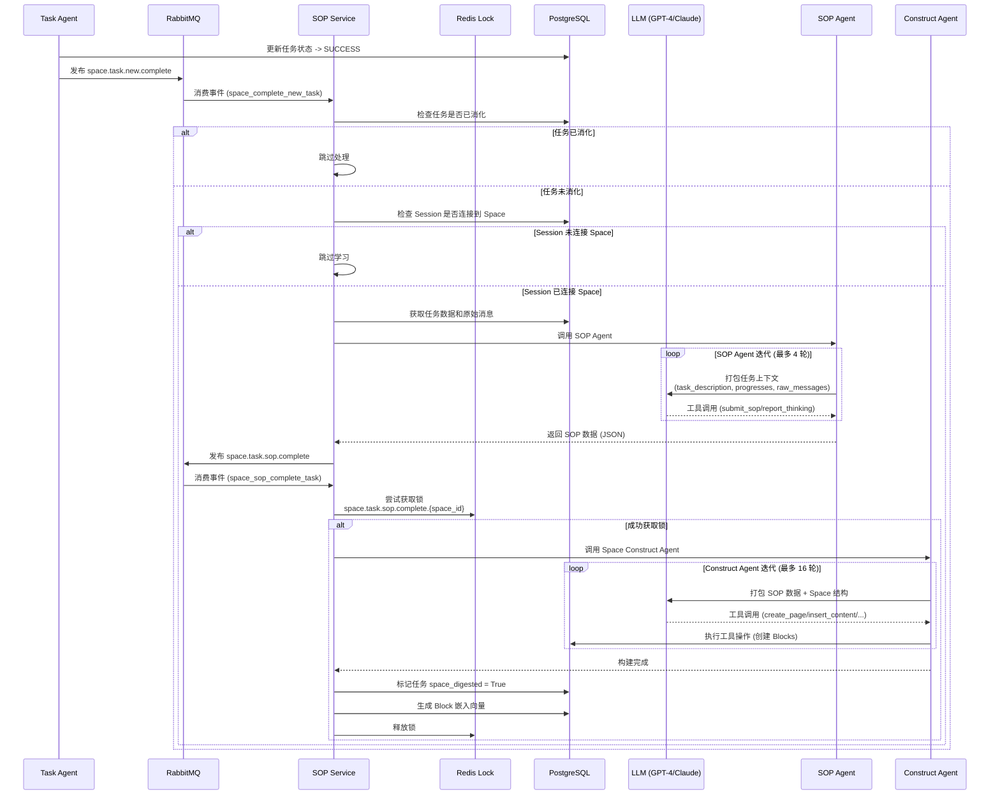
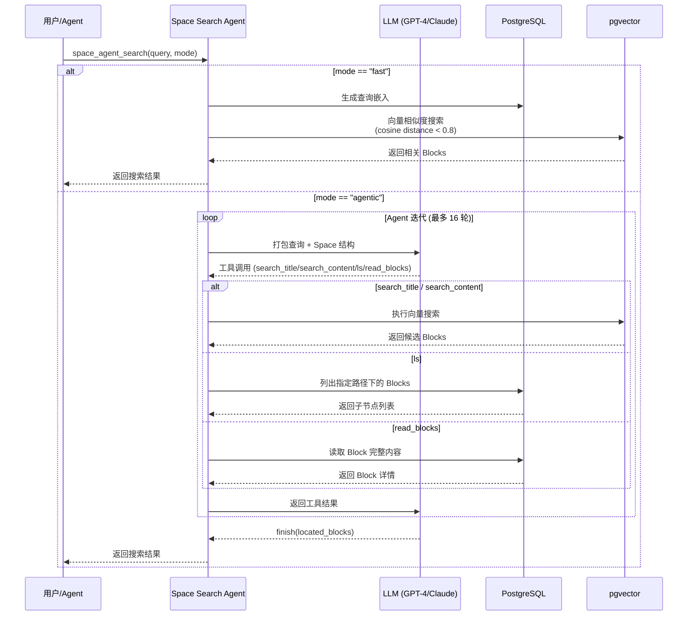
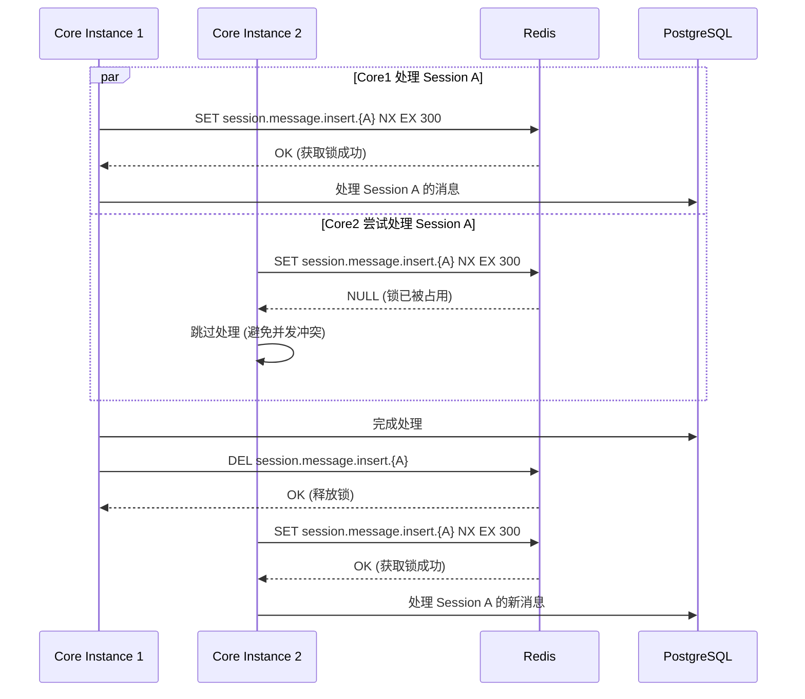
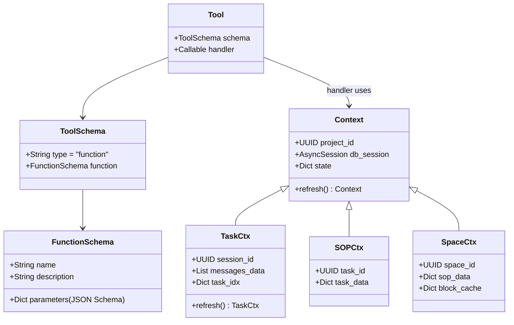
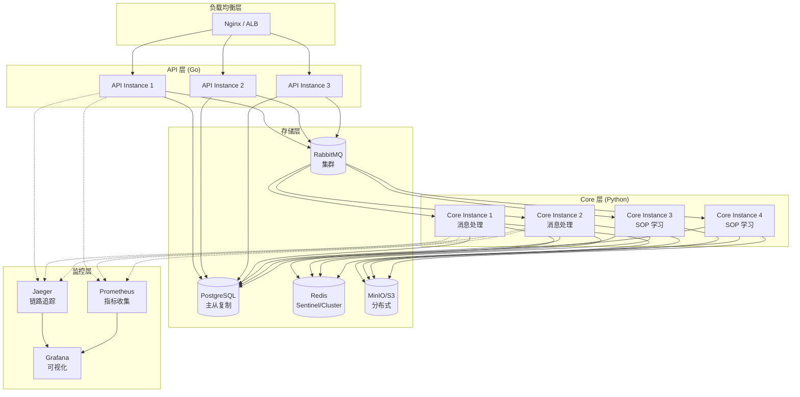

# Python Core 引擎架构设计文档

## 1. 背景

### 1.1 功能介绍

Acontext Python Core 引擎是整个 Acontext 系统的**核心处理大脑**，负责处理所有复杂的异步任务、智能分析和知识学习。它是一个基于事件驱动的多智能体系统，通过消息队列实现了与 API 层的解耦，提供了高度可扩展和可靠的后台处理能力。

Core 引擎的核心功能包括：
- **多智能体任务处理** - Task Agent、SOP Agent、Space Construct Agent、Space Search Agent
- **智能消息缓冲与批处理** - 优化 LLM 调用效率
- **自动任务观察与跟踪** - 实时监控 Agent 执行进度
- **经验式学习系统** - 从成功案例中提炼可复用的操作规程(SOP)
- **层次化知识管理** - 在 Space 中组织和检索技能
- **分布式协调** - 通过 Redis 锁确保数据一致性

### 1.2 需求与痛点

**为什么需要 Python Core 引擎？**

1. **解耦 API 与业务逻辑** - Go API 层只负责快速响应和数据存储，复杂的 LLM 处理交给 Python Core 异步执行，避免阻塞用户请求
2. **智能批处理** - 逐条处理消息会导致大量 LLM 调用，成本高且效率低。需要智能缓冲机制来优化上下文利用
3. **后台任务观察** - Agent 执行过程中的任务状态需要自动跟踪，而不是依赖人工记录或特殊格式的工具调用
4. **知识沉淀与复用** - Agent 每次执行相似任务都从头开始，缺乏学习能力。需要系统自动提取经验并在下次执行时复用
5. **分布式环境下的一致性** - 多个 Core 实例同时处理时，需要确保同一个 Session 或 Space 不会被并发修改
6. **可观测性** - 复杂的异步流程需要完整的链路追踪和指标监控

### 1.3 使用场景

**场景 1：用户与 Agent 交互**
- 用户通过 SDK 发送消息
- API 层快速响应存储后返回
- Core 引擎在后台分析对话，自动提取任务和进度
- 用户可以在 Dashboard 查看实时的任务状态

**场景 2：Agent 完成复杂任务**
- Agent 通过多轮对话完成了一个代码重构任务
- Task Agent 标记任务为 SUCCESS
- SOP Agent 自动分析工具调用序列，提炼出通用的重构流程
- Space Construct Agent 将这个 SOP 存入知识库
- 下次类似任务时，Agent 可以搜索到这个 SOP 作为参考

**场景 3：分布式部署**
- 多个 Core 实例同时运行
- 某个 Session 有新消息到来
- Redis 锁确保只有一个实例处理该 Session
- 处理完成后释放锁，其他实例可以继续

---

## 2. 高层设计

### 2.1 整体架构

Python Core 引擎采用**分层架构 + 事件驱动**的设计模式：



### 2.2 模块分解

#### **初始化层 (Initialization Layer)**
- **di.py** - 依赖注入和生命周期管理
  - `setup()` - 初始化所有基础设施客户端
  - `cleanup()` - 优雅关闭和资源释放
  - 统一管理数据库、Redis、MQ、S3 的连接池

- **env.py** - 配置管理
  - 加载 `config.yaml` 和环境变量
  - 提供 `CoreConfig` (系统级) 和 `ProjectConfig` (项目级) 配置
  - 支持配置热更新

#### **基础设施层 (Infrastructure Layer)**
- **db.py** - 异步数据库连接池
  - SQLAlchemy 2.0 + AsyncPG
  - 连接池管理 (64 连接默认)
  - 健康检查与自动重连
  - OpenTelemetry 自动插桩

- **async_mq.py** - RabbitMQ 异步消费/生产
  - 基于 `aio_pika` 实现
  - 装饰器注册消费者 (`@register_consumer`)
  - 自动重连与指数退避
  - 死信队列 (DLX) 和重试机制
  - 链路追踪上下文传播

- **redis.py** - Redis 分布式锁
  - 连接池 (32 连接默认)
  - `check_redis_lock_or_set()` - 获取锁
  - `release_redis_lock()` - 释放锁
  - 用于 Session 和 Space 级别的并发控制

- **s3.py** - S3/MinIO 资产存储
  - 基于 `aiobotocore` 实现
  - 存储消息 parts、附件等二进制数据
  - 连接池 (32 连接默认)

#### **服务层 (Service Layer)**
- **session_message.py** - 消息处理管道
  - 消费者: `insert_new_message` - 接收新消息
  - 消费者: `buffer_new_message` - 处理缓冲触发
  - 实现智能缓冲逻辑
  - 触发 Task Agent

- **digest_task_to_sop.py** - 任务消化管道
  - 消费者: `space_complete_new_task` - 接收完成的任务
  - 调用 SOP Agent 提炼技能
  - 仅处理连接到 Space 的 Session

- **space_receive_sop.py** - SOP 构建管道
  - 消费者: `space_sop_complete_task` - 接收 SOP 数据
  - 调用 Space Construct Agent 组织知识
  - Space 级别加锁防止并发修改

#### **控制器层 (Controller Layer)**
- **message.py** - 消息处理控制
  - `process_session_pending_message()` - 批量处理待处理消息
  - 更新消息状态 (PENDING -> RUNNING -> SUCCESS/FAILED)

- **space_task.py** - 任务到 SOP 转换
  - `digest_complete_task_to_sop()` - 触发 SOP 提炼

- **space_sop.py** - SOP 到 Block 转换
  - `space_attach_task_sop()` - 触发 Space 构建

#### **智能体层 (Agent Layer)**
- **Task Agent** (`task.py`) - 任务观察员
  - 角色: 项目经理
  - 工具: `insert_task`, `update_task`, `append_messages`, `finish`
  - 最大迭代: 6 轮

- **SOP Agent** (`task_sop.py`) - 经验提炼师
  - 角色: 复盘专家
  - 工具: `submit_sop`, `report_thinking`
  - 最大迭代: 4 轮

- **Space Construct Agent** (`space_construct.py`) - 知识建筑师
  - 角色: 图书管理员
  - 工具: `create_page`, `create_folder`, `insert_content`, `search_title`, `ls`, `mv`, `rename`, `finish`
  - 最大迭代: 16 轮

- **Space Search Agent** (`space_search.py`) - 知识向导
  - 角色: 搜索专家
  - 工具: `search_title`, `search_content`, `read_blocks`, `attach_related`, `ls`, `finish`
  - 最大迭代: 16 轮
  - 支持 Agentic Search 和 Embedding Search

#### **数据层 (Data Layer)**
- **task.py** - 任务 CRUD 操作
- **message.py** - 消息 CRUD + S3 集成
- **block.py** - Space Block 层次结构管理
- **block_search.py** - 向量搜索 (pgvector + 嵌入)

### 2.3 核心流程

**流程 1: 消息处理流程**
```
用户消息 → API 存储 → MQ 事件 → 缓冲检查 → Task Agent → 任务更新
```

**流程 2: 学习流程**
```
任务完成 → MQ 事件 → SOP Agent → MQ 事件 → Space Construct Agent → 知识库更新
```

**流程 3: 搜索流程**
```
用户查询 → Space Search Agent → 向量检索 + 智能导航 → 返回相关 Blocks
```

---

## 3. 数据模型 / API 设计

### 3.1 核心数据结构



### 3.2 消息队列设计

**Exchange: `session.message`**
- `session.message.insert` - 新消息插入事件
- `session.message.buffer.process` - 缓冲超时触发事件
- `session.message.insert.retry` - 重试队列

**Exchange: `space.task`**
- `space.task.new.complete` - 任务完成事件
- `space.task.sop.complete` - SOP 提炼完成事件
- `space.task.sop.complete.retry` - 重试队列

**队列特性:**
- 持久化队列 (durable=True)
- 消息 TTL 配置
- 死信队列 (DLQ) 处理失败消息
- QoS Prefetch: 32 (并发处理数)

### 3.3 核心 API 接口

#### 内部控制器 API

```python
# message.py
async def process_session_pending_message(
    project_config: ProjectConfig,
    project_id: UUID,
    session_id: UUID
) -> None:
    """批量处理待处理消息，触发 Task Agent"""

# space_task.py
async def digest_complete_task_to_sop(
    project_id: UUID,
    session_id: UUID,
    task_id: UUID
) -> None:
    """将完成的任务提炼为 SOP"""

# space_sop.py
async def space_attach_task_sop(
    project_id: UUID,
    space_id: UUID,
    task_id: UUID,
    sop_data: dict
) -> None:
    """将 SOP 数据构建到 Space 中"""
```

#### 智能体 API

```python
# task.py
async def task_agent_curd(
    project_id: UUID,
    session_id: UUID,
    messages_data: List[dict],
    max_iterations: int = 6,
    previous_progress_num: int = 6
) -> None:
    """Task Agent 核心循环"""

# task_sop.py
async def sop_agent_curd(
    project_id: UUID,
    session_id: UUID,
    task_id: UUID,
    custom_scoring_rules: Optional[str] = None
) -> dict:
    """SOP Agent 核心循环，返回 SOP 数据"""

# space_construct.py
async def space_construct_agent_curd(
    project_id: UUID,
    space_id: UUID,
    sop_data: dict
) -> None:
    """Space Construct Agent 核心循环"""

# space_search.py
async def space_agent_search(
    project_id: UUID,
    space_id: UUID,
    query: str,
    mode: Literal["fast", "agentic"] = "fast"
) -> List[Block]:
    """搜索 Space 中的相关 Blocks"""
```

---

## 4. 详细设计

### 4.1 消息处理流程 (Message Processing Flow)



**流程说明:**

1. **消息摄取** - SDK 发送消息到 API，API 立即存储并返回，不阻塞用户
2. **缓冲机制** - Core 不会立即处理每条消息，而是等待缓冲区满或超时
3. **分布式锁** - Redis 锁确保同一个 Session 不会被多个 Core 实例同时处理
4. **批量处理** - 一次性处理多条消息，优化 LLM 上下文利用
5. **智能体循环** - Task Agent 通过工具调用与数据库交互，更新任务状态

**关键代码路径:**
- 消费者入口: `src/server/core/acontext_core/service/session_message.py:41`
- 处理控制: `src/server/core/acontext_core/service/controller/message.py:12`
- Agent 核心: `src/server/core/acontext_core/llm/agent/task.py:116`

---

### 4.2 SOP 学习流程 (SOP Learning Flow)



**流程说明:**

1. **触发条件** - 任务状态变为 SUCCESS 且 Session 连接了 Space
2. **SOP 提炼** - SOP Agent 分析任务执行过程，提取工具调用模式
3. **知识构建** - Space Construct Agent 将 SOP 组织到 Space 层次结构中
4. **向量化** - 为新创建的 Blocks 生成嵌入向量，支持语义搜索
5. **防重复学习** - 通过 `space_digested` 标志避免重复处理

**关键代码路径:**
- 任务消化入口: `src/server/core/acontext_core/service/digest_task_to_sop.py:20`
- SOP Agent: `src/server/core/acontext_core/llm/agent/task_sop.py:51`
- SOP 接收入口: `src/server/core/acontext_core/service/space_receive_sop.py:19`
- Construct Agent: `src/server/core/acontext_core/llm/agent/space_construct.py:60`

---

### 4.3 Space 搜索流程 (Space Search Flow)



**流程说明:**

1. **快速模式 (fast)** - 直接使用嵌入向量进行相似度搜索，适合简单查询
2. **智能模式 (agentic)** - LLM 智能体通过多次工具调用导航 Space 结构，适合复杂查询
3. **向量检索** - 使用 pgvector 的余弦距离计算相似度
4. **工具组合** - Search Agent 可以组合使用 `search_title`, `ls`, `read_blocks` 等工具
5. **指标记录** - 统计 agentic 和 embedding 搜索的使用情况

**关键代码路径:**
- Search Agent: `src/server/core/acontext_core/llm/agent/space_search.py:85`
- 向量搜索: `src/server/core/acontext_core/service/data/block_search.py`

---

### 4.4 分布式锁机制 (Distributed Locking)



**锁的类型:**

1. **Session 级别锁**
   - Key: `session.message.insert.{session_id}`
   - 用途: 确保同一个 Session 的消息不会被并发处理
   - TTL: 300 秒 (自动过期防止死锁)

2. **Space 级别锁**
   - Key: `space.task.sop.complete.{space_id}`
   - 用途: 确保同一个 Space 的结构不会被并发修改
   - TTL: 300 秒

**关键代码路径:**
- 锁实现: `src/server/core/acontext_core/infra/redis.py`
- 使用示例: `src/server/core/acontext_core/service/session_message.py:78`

---

### 4.5 工具系统设计 (Tool System)



**工具定义示例:**

```python
@dataclass
class Tool:
    schema: ToolSchema
    handler: Callable[[Context, dict], Result[str]]

# Task Agent 工具池
TASK_TOOLS = {
    "insert_task": Tool(
        schema=ToolSchema(
            function=FunctionSchema(
                name="insert_task",
                description="在指定位置创建新任务",
                parameters={
                    "type": "object",
                    "properties": {
                        "after_order": {"type": "integer"},
                        "task_description": {"type": "string"},
                    },
                    "required": ["after_order", "task_description"]
                }
            )
        ),
        handler=handle_insert_task
    ),
    # ... 其他工具
}
```

**Handler 实现:**

```python
async def handle_insert_task(ctx: TaskCtx, args: dict) -> Result[str]:
    after_order = args["after_order"]
    description = args["task_description"]

    # 数据库操作
    new_task = await MD.task_insert(
        ctx.db_session,
        ctx.project_id,
        ctx.session_id,
        after_order,
        {"task_description": description}
    )

    # 更新上下文
    ctx.task_idx[new_task.order] = new_task

    return Result.ok(f"成功创建任务 #{new_task.order}")
```

**关键代码路径:**
- 工具基类: `src/server/core/acontext_core/llm/tool/base.py`
- Task 工具池: `src/server/core/acontext_core/llm/tool/task.py`
- SOP 工具池: `src/server/core/acontext_core/llm/tool/task_sop.py`
- Space 工具池: `src/server/core/acontext_core/llm/tool/space.py`

---

## 5. 伪代码实现

### 5.1 消息缓冲与处理核心逻辑

```python
@register_consumer(
    mq_client=MQ_CLIENT,
    config=ConsumerConfigData(
        exchange_name=EX.session_message,
        routing_key=RK.session_message_insert,
        queue_name="session.message.insert.entry",
    ),
)
async def insert_new_message(body: InsertNewMessage, message: Message):
    """
    核心逻辑:
    1. 检查缓冲区大小
    2. 如果未满,启动 TTL 定时器
    3. 如果已满,立即触发处理
    """
    project_config = await get_project_config(body.project_id)

    # 检查缓冲区
    pending_count = await MD.session_message_length(
        body.project_id,
        body.session_id,
        status=MessageStatus.PENDING
    )

    max_turns = project_config.project_session_message_buffer_max_turns

    if pending_count < max_turns:
        # 缓冲区未满,等待 TTL
        ttl = project_config.project_session_message_buffer_ttl_seconds
        asyncio.create_task(
            waiting_for_message_notify(ttl, body)
        )
        await message.ack()
        return

    # 缓冲区已满,立即处理
    await process_and_ack(body, message)


async def waiting_for_message_notify(ttl_seconds: int, body: InsertNewMessage):
    """
    等待 TTL 超时后触发处理
    """
    await asyncio.sleep(ttl_seconds)

    # 发布到缓冲处理队列
    await MQ_CLIENT.publish(
        exchange_name=EX.session_message,
        routing_key=RK.session_message_buffer_process,
        body=body.to_dict()
    )


async def process_and_ack(body: InsertNewMessage, message: Message):
    """
    实际处理逻辑
    """
    # 获取分布式锁
    lock_key = f"session.message.insert.{body.session_id}"
    lock_acquired = await check_redis_lock_or_set(
        body.project_id,
        lock_key,
        ex=300  # 5 分钟超时
    )

    if not lock_acquired:
        # 其他实例正在处理,跳过
        await message.ack()
        return

    try:
        # 调用控制器处理
        await MC.process_session_pending_message(
            project_config,
            body.project_id,
            body.session_id
        )
        await message.ack()
    finally:
        # 释放锁
        await release_redis_lock(body.project_id, lock_key)
```

---

### 5.2 Task Agent 核心循环

```python
async def task_agent_curd(
    project_id: UUID,
    session_id: UUID,
    messages_data: List[dict],
    max_iterations: int = 6,
    previous_progress_num: int = 6
) -> None:
    """
    Task Agent 核心逻辑:
    1. 打包上下文 (任务列表 + 进度历史 + 当前消息)
    2. 调用 LLM 进行工具调用
    3. 执行工具并更新数据库
    4. 循环迭代直到 finish() 或达到最大迭代数
    """
    async with get_db_session() as db_session:
        # 初始化上下文
        ctx = await pack_task_context(
            db_session,
            project_id,
            session_id,
            messages_data,
            previous_progress_num
        )

        # 构建工具列表
        tools = [tool.schema for tool in TASK_TOOLS.values()]

        # Agent 循环
        for i in range(max_iterations):
            # 调用 LLM
            response = await llm_client.chat.completions.create(
                model="gpt-4.1",
                messages=[
                    {"role": "system", "content": TASK_PROMPT},
                    {"role": "user", "content": ctx.to_prompt()}
                ],
                tools=tools
            )

            # 处理工具调用
            if response.choices[0].finish_reason == "tool_calls":
                for tool_call in response.choices[0].message.tool_calls:
                    tool_name = tool_call.function.name
                    tool_args = json.loads(tool_call.function.arguments)

                    # 执行工具
                    tool = TASK_TOOLS[tool_name]
                    result = await tool.handler(ctx, tool_args)

                    # 如果工具修改了数据库,刷新上下文
                    if tool_name in ["insert_task", "update_task", "append_messages_to_task"]:
                        ctx = await ctx.refresh()

                    # 如果是 finish,退出循环
                    if tool_name == "finish":
                        return
            else:
                # LLM 完成,但未调用 finish
                break

        # 达到最大迭代数
        LOG.warning(f"Task Agent reached max iterations ({max_iterations})")


async def pack_task_context(
    db_session,
    project_id,
    session_id,
    messages_data,
    previous_progress_num
) -> TaskCtx:
    """
    打包任务上下文
    """
    # 获取当前任务列表
    tasks = await MD.task_list(
        db_session,
        project_id,
        session_id,
        order_by="order"
    )

    # 获取最近进度
    recent_progresses = []
    for task in tasks:
        progresses = task.data.get("progresses", [])
        recent_progresses.extend(progresses[-previous_progress_num:])

    return TaskCtx(
        project_id=project_id,
        session_id=session_id,
        db_session=db_session,
        messages_data=messages_data,
        task_idx={task.order: task for task in tasks},
        recent_progresses=recent_progresses
    )
```

---

### 5.3 SOP Agent 核心逻辑

```python
async def sop_agent_curd(
    project_id: UUID,
    session_id: UUID,
    task_id: UUID,
    custom_scoring_rules: Optional[str] = None
) -> dict:
    """
    SOP Agent 核心逻辑:
    1. 打包任务数据和原始消息
    2. 调用 LLM 分析工具调用模式
    3. 提取 SOP 数据 (use_when, preferences, tool_sops)
    4. 返回结构化 SOP JSON
    """
    async with get_db_session() as db_session:
        # 获取任务数据
        task = await MD.task_get(db_session, project_id, session_id, task_id)

        # 获取任务关联的消息
        task_messages = await MD.task_messages(
            db_session,
            project_id,
            session_id,
            task_id
        )

        # 构建上下文
        ctx = SOPCtx(
            project_id=project_id,
            task_id=task_id,
            db_session=db_session,
            task_data=task.data,
            raw_messages=task_messages,
            custom_scoring_rules=custom_scoring_rules
        )

        # 构建 Prompt
        prompt = SOP_PROMPT.format(
            task_description=task.data["task_description"],
            progresses=task.data.get("progresses", []),
            user_preferences=task.data.get("user_preferences", []),
            raw_messages=format_messages(task_messages),
            custom_scoring_rules=custom_scoring_rules or "无自定义规则"
        )

        # 构建工具列表
        tools = [tool.schema for tool in SOP_TOOLS.values()]

        # Agent 循环
        sop_data = None
        for i in range(4):  # 最多 4 轮
            response = await llm_client.chat.completions.create(
                model="gpt-4.1",
                messages=[
                    {"role": "system", "content": prompt},
                ],
                tools=tools
            )

            # 处理工具调用
            for tool_call in response.choices[0].message.tool_calls:
                if tool_call.function.name == "submit_sop":
                    args = json.loads(tool_call.function.arguments)
                    sop_data = {
                        "use_when": args["use_when"],
                        "preferences": args.get("preferences"),
                        "tool_sops": args["tool_sops"],
                        "complexity_score": args.get("complexity_score", 5),
                        "reliability_score": args.get("reliability_score", 5)
                    }
                    return sop_data

        raise Exception("SOP Agent 未能提交 SOP")
```

---

### 5.4 Space Construct Agent 核心逻辑

```python
async def space_construct_agent_curd(
    project_id: UUID,
    space_id: UUID,
    sop_data: dict
) -> None:
    """
    Space Construct Agent 核心逻辑:
    1. 打包 SOP 数据和 Space 结构
    2. 调用 LLM 导航和创建 Blocks
    3. 生成嵌入向量
    """
    async with get_db_session() as db_session:
        # 初始化上下文
        ctx = SpaceCtx(
            project_id=project_id,
            space_id=space_id,
            db_session=db_session,
            sop_data=sop_data,
            block_cache={}
        )

        # 构建工具列表
        tools = [tool.schema for tool in SPACE_TOOLS.values()]

        # 构建 Prompt
        prompt = SPACE_CONSTRUCT_PROMPT.format(
            sop_use_when=sop_data["use_when"],
            sop_tool_sops=sop_data["tool_sops"],
            sop_preferences=sop_data.get("preferences")
        )

        # Agent 循环
        for i in range(16):  # 最多 16 轮
            response = await llm_client.chat.completions.create(
                model="gpt-4.1",
                messages=[
                    {"role": "system", "content": prompt},
                ],
                tools=tools
            )

            # 处理工具调用
            for tool_call in response.choices[0].message.tool_calls:
                tool_name = tool_call.function.name
                tool_args = json.loads(tool_call.function.arguments)

                tool = SPACE_TOOLS[tool_name]
                result = await tool.handler(ctx, tool_args)

                # 如果是 finish,退出循环
                if tool_name == "finish":
                    # 生成嵌入向量
                    await generate_embeddings(ctx)
                    return

        LOG.warning("Space Construct Agent 达到最大迭代数")


async def generate_embeddings(ctx: SpaceCtx):
    """
    为新创建的 Blocks 生成嵌入向量
    """
    for block_id, block in ctx.block_cache.items():
        if block.type in ["sop", "text"]:
            # 生成嵌入
            embedding = await embedding_client.create_embedding(
                text=f"{block.title}\n{json.dumps(block.content)}"
            )

            # 保存到数据库
            await MD.block_embedding_insert(
                ctx.db_session,
                block_id,
                embedding,
                provider="openai"
            )
```

---

## 6. 可观测性与监控

### 6.1 OpenTelemetry 集成

**Trace 传播:**
```python
# 在 MQ 消息中注入 trace context
from opentelemetry import propagate

headers = {}
propagate.inject(headers)

await MQ_CLIENT.publish(
    exchange_name=EX.session_message,
    routing_key=RK.session_message_insert,
    body=body.to_dict(),
    headers=headers
)

# 在消费者中提取 trace context
context = propagate.extract(message.headers)
with tracer.start_as_current_span("process_message", context=context):
    # 处理逻辑
```

**自定义 Span:**
```python
from acontext_core.infra.otel import tracer

@tracer.start_as_current_span("task_agent_iteration")
async def task_agent_curd(...):
    with tracer.start_as_current_span("pack_context"):
        ctx = await pack_task_context(...)

    with tracer.start_as_current_span("llm_call"):
        response = await llm_client.chat.completions.create(...)
```

### 6.2 指标监控

**关键指标:**
```python
class MetricTags:
    new_task_created = "task.created"
    new_skill_learned = "space.learned"
    new_experience_agentic_search = "search.experience.agentic"
    new_experience_embedding_search = "search.experience.embedding"
    task_success = "task.success"
    task_failed = "task.failed"

# 使用示例
await capture_increment(
    project_id,
    MetricTags.new_task_created
)
```

### 6.3 结构化日志

**日志上下文:**
```python
from acontext_core.infra.log import LOG, bound_logging_vars

# 绑定上下文变量
with bound_logging_vars(
    project_id=str(project_id),
    session_id=str(session_id),
    queue_name="session.message.insert"
):
    LOG.info("处理消息", extra={
        "message_count": len(messages),
        "buffer_size": pending_count
    })
```

---

## 7. 配置管理

### 7.1 系统级配置 (CoreConfig)

```yaml
# config.yaml
core:
  # LLM 配置
  llm_sdk: "openai"  # openai | anthropic
  llm_api_key: "sk-..."
  llm_base_url: null
  llm_simple_model: "gpt-4.1"
  llm_response_timeout: 60

  # 嵌入配置
  embedding_provider: "openai"  # openai | jina
  embedding_api_key: "sk-..."
  embedding_dimensions: 1536

  # 数据库配置
  db_host: "localhost"
  db_port: 5432
  db_user: "acontext"
  db_password: "password"
  db_name: "acontext"
  db_pool_size: 64
  db_pool_recycle: 600

  # Redis 配置
  redis_host: "localhost"
  redis_port: 6379
  redis_password: null
  redis_pool_size: 32

  # RabbitMQ 配置
  mq_host: "localhost"
  mq_port: 5672
  mq_user: "acontext"
  mq_password: "password"
  mq_vhost: "/"
  mq_prefetch_count: 32

  # S3 配置
  s3_endpoint: "http://localhost:9000"
  s3_access_key: "minioadmin"
  s3_secret_key: "minioadmin"
  s3_bucket_name: "acontext"
  s3_connection_pool_size: 32

  # OpenTelemetry 配置
  otel_enabled: true
  otel_exporter_otlp_endpoint: "http://localhost:4317"
  otel_sample_ratio: 1.0
  otel_service_name: "acontext-core"
```

### 7.2 项目级配置 (ProjectConfig)

```python
class ProjectConfig:
    # 消息缓冲配置
    project_session_message_buffer_max_turns: int = 2
    project_session_message_buffer_ttl_seconds: int = 10

    # Agent 迭代配置
    task_agent_max_iterations: int = 6
    sop_agent_max_iterations: int = 4
    space_construct_agent_max_iterations: int = 16
    space_search_agent_max_iterations: int = 16

    # 上下文配置
    task_agent_previous_progress_num: int = 6
    sop_agent_previous_task_num: int = 5

    # 学习配置
    sop_agent_custom_scoring_rules: Optional[str] = None
    experience_confirmation_enabled: bool = False

    # 搜索配置
    embedding_search_threshold: float = 0.8
```

---

## 8. 部署架构

### 8.1 生产环境推荐架构



### 8.2 扩展性建议

**水平扩展:**
- API 层: 无状态设计,可任意扩展实例数
- Core 层: 通过 Redis 锁实现分布式协调,可任意扩展消费者实例
- 存储层: PostgreSQL 读写分离,Redis 集群,RabbitMQ 集群

**垂直扩展:**
- Core 实例建议配置: 4 核 CPU + 8GB 内存
- 数据库建议配置: 8 核 CPU + 32GB 内存 + SSD 存储

**容量规划:**
- 每个 Core 实例可处理约 100 并发 Session
- RabbitMQ Prefetch 设置为 32,平衡吞吐量和内存使用
- PostgreSQL 连接池设置为 64,避免连接耗尽

---

## 9. 设计权衡与最佳实践

### 9.1 为什么选择异步架构？

**优点:**
- ✅ API 快速响应,不阻塞用户请求
- ✅ 解耦 API 和 Core,独立扩展
- ✅ 支持复杂的多步骤处理流程
- ✅ 自然支持重试和错误恢复

**缺点:**
- ❌ 增加系统复杂度
- ❌ 需要处理消息顺序和幂等性
- ❌ 调试链路追踪更困难

### 9.2 为什么使用消息缓冲？

**原因:**
- 减少 LLM 调用次数,降低成本
- 批量处理提高上下文利用率
- 避免频繁唤醒 Agent

**权衡:**
- 增加了延迟 (最多 10 秒)
- 需要配置合理的缓冲参数

### 9.3 为什么选择 PostgreSQL + pgvector？

**原因:**
- 统一存储结构化数据和向量
- 避免多系统同步问题
- 支持 SQL 和向量检索混合查询
- 成熟的事务和一致性保证

**权衡:**
- 向量检索性能不如专用向量库 (如 Pinecone)
- 需要合理设计索引避免慢查询

### 9.4 为什么使用 Redis 锁而不是数据库锁？

**原因:**
- Redis 锁性能更高
- 支持自动过期,避免死锁
- 天然支持分布式环境

**权衡:**
- 需要处理 Redis 不可用情况
- 锁粒度需要权衡 (Session 级 vs 全局)

---

## 10. 未来演进方向

### 10.1 性能优化
- 引入缓存层减少数据库查询
- 优化嵌入向量生成 (批量生成)
- 实现智能 Prefetch 减少 Agent 迭代次数

### 10.2 功能增强
- 支持更多 LLM Provider (如 Claude, Gemini)
- 实现 Agent 的流式输出
- 支持用户自定义 Tool 注册

### 10.3 可观测性
- 完善 Metrics Dashboard
- 增加 Agent 执行时长分析
- 实现自动异常告警

### 10.4 稳定性
- 实现优雅重启机制
- 增加限流和熔断保护
- 支持多租户资源隔离

---

## 11. 参考资料

**源码关键路径:**
- 初始化入口: `src/server/core/acontext_core/di.py`
- 消息处理: `src/server/core/acontext_core/service/session_message.py`
- Task Agent: `src/server/core/acontext_core/llm/agent/task.py`
- SOP Agent: `src/server/core/acontext_core/llm/agent/task_sop.py`
- Construct Agent: `src/server/core/acontext_core/llm/agent/space_construct.py`
- Search Agent: `src/server/core/acontext_core/llm/agent/space_search.py`

**相关文档:**
- [架构概览](./architecture.md)
- [Task Agent 深度解析](./task-agent-deep-dive.md)
- [SOP Learning 深度解析](./sop-learning-deep-dive.md)
- [技能搜索深度解析](./skill-search-deep-dive.md)

---

**文档维护:**
- 作者: Claude Code (Opus 4.5)
- 创建时间: 2025-12-11
- 版本: 1.0
- 状态: 初稿完成
