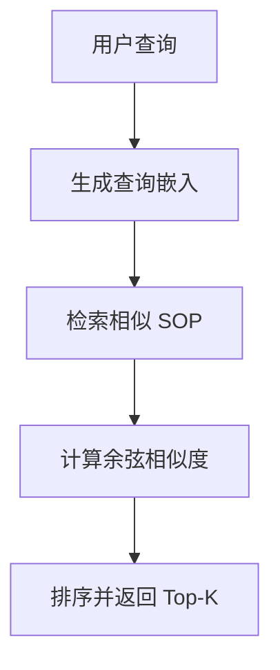
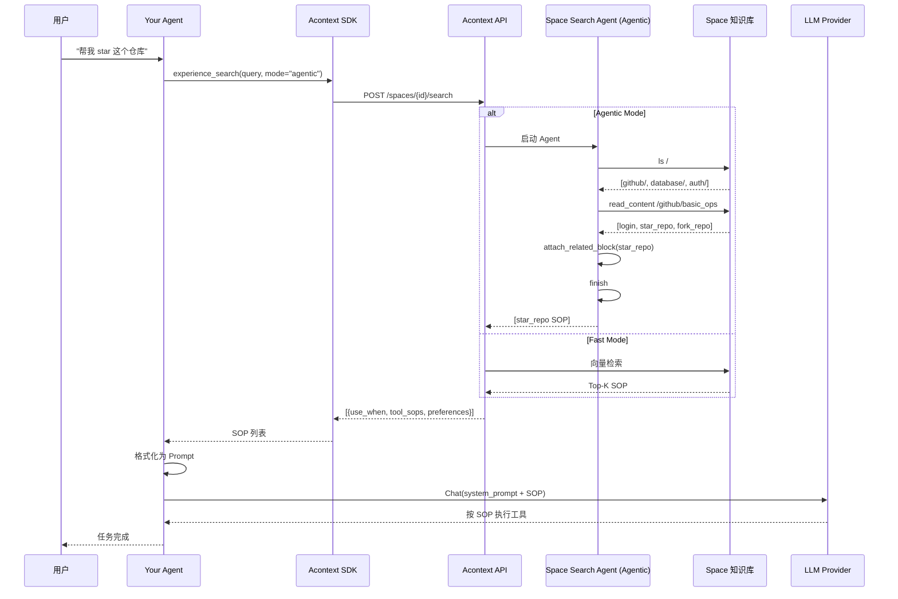

本文档详细解释了 Acontext 的 **Skill Search** 功能 —— 如何从 Space 中检索相关的 SOP(Standard Operating Procedure),并将其应用到新的任务中。

## 概览

Skill Search 是 Acontext 自学习循环的**最后一环**。当 Agent 遇到新任务时,它可以:

1. 🔍 **搜索相关 SOP** - 从 Space 知识库中找到匹配的技能
2. 📋 **获取操作步骤** - 得到工具调用的标准流程
3. 🎯 **应用到任务** - 将 SOP 作为 Agent 的指导
4. ⚡ **提升成功率** - 减少错误和重试,更快完成任务

---

## 1. 两种搜索模式

Acontext 提供两种搜索模式,适用于不同场景:

### Fast Mode - 快速嵌入搜索

**工作原理:**
- 使用向量嵌入(Embeddings)快速匹配
- 基于语义相似度排序
- 适合简单场景和快速响应

**优点:**
- ⚡ 速度快(通常 < 1 秒)
- 💰 成本低(少量 LLM 调用)
- 🎯 准确度高(单一明确需求)

**缺点:**
- ❌ 可能遗漏相关内容
- ❌ 无法处理复杂组合需求

**使用场景:**
- 用户查询简单明确
- 只需要 1-2 个 SOP
- 实时交互场景

### Agentic Mode - 智能 Agent 搜索

**工作原理:**
- 使用 **Space Search Agent** 深度探索
- 类似 Notion/Obsidian 专家在知识库中导航
- 使用工具遍历 Folder、Page、Block

**优点:**
- 🧠 理解复杂查询
- 🔍 全面覆盖相关内容
- 🎯 可找到多个相关 SOP

**缺点:**
- ⏱️ 速度较慢(通常 5-15 秒)
- 💰 成本较高(多次 LLM 调用)

**使用场景:**
- 复杂的多步骤任务
- 需要综合多个技能
- 离线或批处理场景

---

## 2. Fast Mode 详解

### API 调用

```python
from acontext import AcontextClient

client = AcontextClient(
    base_url="http://localhost:8029/api/v1",
    api_key="sk-ac-your-root-api-bearer-token"
)

# Fast Mode 搜索
result = client.spaces.experience_search(
    space_id="space-uuid",
    query="I need to star a GitHub repository",
    mode="fast",
    limit=5  # 最多返回 5 个 SOP
)

# 结果包含匹配的 SOP
for sop in result.items:
    print(f"Use when: {sop.use_when}")
    print(f"Steps: {len(sop.tool_sops)}")
    print(f"Preferences: {sop.preferences}")
```

### 工作流程



**步骤详解:**

1. **查询嵌入**
   - 将用户查询转换为向量
   - 使用配置的嵌入模型(默认 OpenAI `text-embedding-3-small`)

2. **向量检索**
   - 从 PostgreSQL 的 `pgvector` 扩展中检索
   - 计算余弦相似度: `cosine_similarity(query_embedding, sop_embedding)`

3. **排序过滤**
   - 按相似度降序排序
   - 返回 Top-K 个结果(默认 K=10)

**源码位置:**
- [`embeddings/openai_embedding.py`](src/server/core/acontext_core/llm/embeddings/openai_embedding.py) - 嵌入生成
- [`block_search.py`](src/server/core/acontext_core/service/data/block_search.py) - 向量检索

---

## 3. Agentic Mode 详解

### API 调用

```python
# Agentic Mode 搜索
result = client.spaces.experience_search(
    space_id="space-uuid",
    query="I need to implement user authentication with email verification",
    mode="agentic",
    limit=10  # 最多返回 10 个 SOP
)

# 结果包含综合找到的所有相关 SOP
for sop in result.items:
    print(f"Path: {sop.path}")  # SOP 在 Space 中的路径
    print(f"Use when: {sop.use_when}")
    print(f"Tool steps: {[step.tool_name for step in sop.tool_sops]}")
```

### Space Search Agent

Agentic Mode 背后是一个**类似 Notion 专家的 Agent**,它会:

1. **理解用户查询** - 分析需求的语义
2. **导航 Space 结构** - 像文件系统一样遍历
3. **阅读相关内容** - 深入 Page 查看 Block
4. **收集匹配 SOP** - 将相关的 Block 添加到结果

### Agent 可用工具

Space Search Agent 拥有以下工具:

| 工具名称 | 功能 | 示例 |
|---------|------|------|
| `ls` | 列出目录内容 | `ls /github/` |
| `search_title` | 按标题搜索 Page | `search_title "authentication"` |
| `search_content` | 按内容搜索 Block | `search_content "email verification"` |
| `read_content` | 读取 Page 的所有 Block | `read_content /auth/email_verify` |
| `attach_related_block` | 标记相关的 Block | `attach_related_block block_id` |
| `finish` | 完成搜索 | `finish` |
| `report_thinking` | 报告思考过程(CoT) | - |

**源码位置:**
- [`space_search_tools.py`](src/server/core/acontext_core/llm/tool/space_search_tools.py) - 工具定义
- [`space_search.py:30`](src/server/core/acontext_core/llm/agent/space_search.py:30) - Agent 核心逻辑

### 搜索策略

Space Search Agent 使用**语义优先的导航策略**:

```python
# src/server/core/acontext_core/llm/prompt/space_search.py:22-23
- Always first to explore those pages that their paths are 
  semantically related to the user query.
```

**导航示例:**

假设 Space 结构:
```
/
├── github/
│   ├── basic_ops/
│   └── trending/
├── database/
│   └── query_patterns/
└── auth/
    ├── email_verify/
    └── oauth/
```

**查询:** "I need to implement GitHub OAuth login"

**Agent 思考过程:**

1. **初始导航**
   ```
   [navigation] User query mentions "GitHub OAuth login"
   - Semantically related paths: /github/, /auth/oauth/
   - Start with: ls /
   ```

2. **优先探索相关路径**
   ```
   [action] ls /auth/
   Result: email_verify/, oauth/
   
   [action] read_content /auth/oauth/
   Result: Found SOP "oauth_flow" with tool_sops for GitHub OAuth
   
   [before_attach] This SOP directly matches the query
   [action] attach_related_block oauth_flow_block_id
   ```

3. **继续搜索**
   ```
   [action] search_content "GitHub login"
   Result: Found page /github/basic_ops with "login" SOP
   
   [action] read_content /github/basic_ops
   [before_attach] This has login steps but not OAuth specific
   [action] attach_related_block login_block_id
   ```

4. **完成搜索**
   ```
   [finish] I have attached 2 relevant SOPs:
   - /auth/oauth/oauth_flow
   - /github/basic_ops/login
   ```

### 并行搜索优化

Agent 会尝试**并行调用工具**以提高效率:

```python
# src/server/core/acontext_core/llm/prompt/space_search.py:32-33
- If you have to search multiple times, use parallel tool calls 
  to search at the same time.
```

**示例:**

```python
# 串行搜索(慢)
search_title "authentication"  # 等待结果
search_title "email"           # 等待结果

# 并行搜索(快)
[
  search_title "authentication",
  search_title "email",
  search_content "verify"
]  # 同时执行
```

---

## 4. 搜索结果的使用

### 结果结构

无论哪种模式,搜索结果都包含:

```typescript
interface ExperienceSearchResult {
  items: SOPBlock[];  // 匹配的 SOP 列表
}

interface SOPBlock {
  id: string;                // Block ID
  space_id: string;          // 所属 Space
  path: string;              // 在 Space 中的路径
  use_when: string;          // 使用场景
  preferences: string;       // 用户偏好
  tool_sops: SOPStep[];      // 工具调用步骤
}

interface SOPStep {
  tool_name: string;  // 工具名称
  action: string;     // 操作描述
}
```

### 应用到 Agent Prompt

将搜索到的 SOP 整合到 Agent 的 Prompt 中:

```python
# 1. 搜索相关 SOP
result = client.spaces.experience_search(
    space_id=space.id,
    query="I need to star a GitHub repository",
    mode="fast"
)

# 2. 格式化为 Prompt
sop_context = format_sops_for_prompt(result.items)

# 3. 构建 Agent Prompt
system_prompt = f"""
You are a helpful assistant. 

When performing tasks, refer to the following Standard Operating Procedures:

{sop_context}

Follow these SOPs to ensure consistency and avoid common mistakes.
"""

# 4. 调用 LLM
response = openai.chat.completions.create(
    model="gpt-4",
    messages=[
        {"role": "system", "content": system_prompt},
        {"role": "user", "content": "Please star https://github.com/memodb-io/Acontext"}
    ]
)
```

**SOP 格式化示例:**

```python
def format_sops_for_prompt(sops):
    sections = []
    for sop in sops:
        steps = "\n".join([
            f"  {i+1}. {step.tool_name}: {step.action}"
            for i, step in enumerate(sop.tool_sops)
        ])
        
        section = f"""
## SOP: {sop.use_when}

**User Preferences:** {sop.preferences or 'None'}

**Steps:**
{steps}
"""
        sections.append(section)
    
    return "\n\n".join(sections)
```

**生成的 Prompt 示例:**

```
## SOP: star a repo on github.com

**User Preferences:** use personal account, star but not fork

**Steps:**
  1. goto: goto the user given github repo url
  2. click: find login button if any, and start to login first
  3. click: click the Star button of the target repo
```

---

## 5. 完整工作流程

### 端到端流程图



---

## 6. 性能对比

### Fast Mode vs Agentic Mode

| 指标 | Fast Mode | Agentic Mode |
|------|-----------|--------------|
| **速度** | < 1 秒 | 5-15 秒 |
| **LLM 调用** | 0 次 | 5-20 次 |
| **覆盖率** | 60-80% | 90-100% |
| **精确度** | 高(单一需求) | 极高(复杂需求) |
| **成本** | 低 | 中高 |
| **适用场景** | 简单查询 | 复杂任务 |

### 选择建议

**使用 Fast Mode 当:**
- ✅ 查询简单明确
- ✅ 只需 1-2 个 SOP
- ✅ 实时交互场景
- ✅ 成本敏感

**使用 Agentic Mode 当:**
- ✅ 多步骤复杂任务
- ✅ 需要综合多个技能
- ✅ 查询语义复杂
- ✅ 准确性优先

---

## 7. 高级用法

### 混合模式

先用 Fast Mode 快速检索,如果结果不理想再用 Agentic Mode:

```python
def smart_search(client, space_id, query, limit=10):
    # 1. 先尝试 Fast Mode
    fast_result = client.spaces.experience_search(
        space_id=space_id,
        query=query,
        mode="fast",
        limit=limit
    )
    
    # 2. 如果结果少于阈值,使用 Agentic Mode
    if len(fast_result.items) < 3:
        return client.spaces.experience_search(
            space_id=space_id,
            query=query,
            mode="agentic",
            limit=limit
        )
    
    return fast_result
```

### 缓存搜索结果

对于频繁的查询,缓存搜索结果:

```python
import hashlib

search_cache = {}

def cached_search(client, space_id, query, mode, limit):
    # 生成缓存 key
    cache_key = hashlib.md5(
        f"{space_id}:{query}:{mode}:{limit}".encode()
    ).hexdigest()
    
    # 检查缓存
    if cache_key in search_cache:
        return search_cache[cache_key]
    
    # 执行搜索
    result = client.spaces.experience_search(
        space_id=space_id,
        query=query,
        mode=mode,
        limit=limit
    )
    
    # 缓存结果
    search_cache[cache_key] = result
    return result
```

### 多 Space 搜索

如果有多个专门化的 Space:

```python
def multi_space_search(client, space_ids, query, mode="fast"):
    all_sops = []
    
    for space_id in space_ids:
        result = client.spaces.experience_search(
            space_id=space_id,
            query=query,
            mode=mode
        )
        all_sops.extend(result.items)
    
    # 去重(基于 use_when)
    seen = set()
    unique_sops = []
    for sop in all_sops:
        if sop.use_when not in seen:
            seen.add(sop.use_when)
            unique_sops.append(sop)
    
    return unique_sops
```

---

## 8. 最佳实践

### 对于查询构建:

1. **明确具体**
   - ✅ "I need to star a GitHub repository using personal account"
   - ❌ "Help me with GitHub"

2. **包含关键词**
   - 包含工具名称: "使用 SQL 查询"
   - 包含领域词汇: "在 github.com 上"

3. **描述意图而非实现**
   - ✅ "实现用户邮箱验证"
   - ❌ "发送邮件,点击链接,更新数据库"

### 对于 Space 组织:

1. **合理的目录结构**
   ```
   /github/
     ├── basic_ops/    # 基础操作
     └── advanced/     # 高级功能
   /database/
     ├── mysql/
     └── postgresql/
   ```

2. **语义化的命名**
   - Folder: 按领域或服务命名
   - Page: 按功能模块命名
   - Block: `use_when` 要具体明确

3. **避免过度嵌套**
   - 最多 3-4 层深度
   - 每个 Page 不超过 10 个 Block

---

## 9. 常见问题

### Q1: 搜索找不到相关 SOP?

**可能原因:**
1. Space 中确实没有相关 SOP(检查 Dashboard)
2. `use_when` 与查询语义差距太大
3. Fast Mode 的嵌入模型理解偏差
4. Agentic Mode 的导航策略不当

**解决方案:**
- 尝试换用另一种模式
- 调整查询关键词
- 检查 SOP 的 `use_when` 是否准确

### Q2: Agentic Mode 太慢怎么办?

**优化方案:**
1. 减少 `max_iterations` 参数
2. 使用更快的 LLM 模型
3. 优化 Space 结构(减少嵌套)
4. 对常见查询使用 Fast Mode

### Q3: 如何评估搜索质量?

**评估指标:**
1. **召回率** - 相关 SOP 是否都被找到?
2. **精确率** - 返回的 SOP 是否都相关?
3. **排序质量** - 最相关的是否排在前面?

**评估方法:**
- 人工抽样检查
- 对比两种模式的结果
- 跟踪 Agent 的实际使用情况

---

## 总结

Skill Search 是 Acontext 自学习循环的**关键一环**,它让 Agent 能够**复用过去的经验**。两种搜索模式各有优势:

- **Fast Mode**: 速度快、成本低,适合简单场景
- **Agentic Mode**: 覆盖全、精度高,适合复杂任务

通过合理选择搜索模式和组织 Space 结构,可以显著提升 Agent 的:
- ⚡ 执行效率(减少重试)
- ✅ 成功率(遵循已验证的流程)
- 🎯 一致性(统一的操作规范)

<CardGroup cols={2}>
<Card title="SOP Learning" icon="graduation-cap" href="/learn/sop-learning-deep-dive">
了解 SOP 是如何从任务中学习得来的
</Card>

<Card title="Skill Space" icon="folder-tree" href="/learn/skill-space">
查看 Skill Space 的基础概念和使用方法
</Card>
</CardGroup>