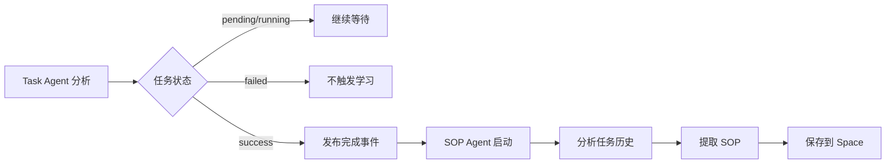
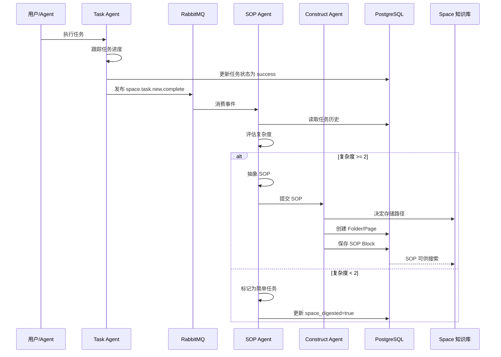

本文档详细解释了 Acontext 的 **SOP Learning** 功能 —— 如何从 Agent 完成的任务中自动提取标准操作流程(Standard Operating Procedure),并将其转化为可复用的技能。

## 概览

SOP Learning 是 Acontext 的核心创新功能,它让 Agent 能够像人类一样**从经验中学习**。每当一个任务成功完成时,系统会自动:

1. 🔍 **分析任务** - 检查任务的复杂度和工具调用模式
2. 📝 **提取 SOP** - 将工具调用序列抽象为可复用的操作步骤
3. 🗂️ **保存到 Space** - 将 SOP 以结构化方式存储到知识库
4. 🔄 **供未来使用** - 下次遇到类似任务时自动应用

---

## 1. 触发时机:何时开始学习?

### 触发条件

SOP Learning 的触发基于**任务完成事件**:



### 具体触发流程

**步骤 1: 任务标记为成功**

当 Task Agent 将任务状态更新为 `success` 时:

```python
# src/server/core/acontext_core/llm/tool/task_lib/update.py:52-61
if task_status == TaskStatus.SUCCESS.value:
    asyncio.create_task(
        send_complete_new_task(
            NewTaskComplete(
                project_id=ctx.project_id,
                session_id=ctx.session_id,
                task_id=actually_task_id,
            )
        )
    )
```

**步骤 2: 发布到 MQ**

事件发布到 RabbitMQ 的 `space.task.new.complete` 队列:

```python
# src/server/core/acontext_core/llm/tool/task_lib/update.py:13-18
async def send_complete_new_task(body: NewTaskComplete):
    await MQ_CLIENT.publish(
        exchange_name=EX.space_task,
        routing_key=RK.space_task_new_complete,
        body=body.model_dump_json(),
    )
```

**步骤 3: 消费者检查条件**

Python Core 消费事件并检查:

```python
# src/server/core/acontext_core/service/digest_task_to_sop.py:20-36
async def space_complete_new_task(body: NewTaskComplete, message: Message):
    # 1. 检查 Session 是否关联了 Space
    session_data = await SD.fetch_session(db_session, body.session_id)
    if session_data.space_id is None:
        LOG.info(f"Session {body.session_id} has no linked space")
        return  # 未关联 Space,不学习
    
    # 2. 检查任务是否已经被学习过
    task_data = await TD.fetch_task(db_session, body.task_id)
    if task_data.space_digested:
        LOG.info(f"Task {body.task_id} is already digested")
        return  # 已学习,跳过
```

**关键条件:**
- ✅ Session 必须关联 Space (通过 `space_id`)
- ✅ 任务状态为 `success`
- ✅ 任务尚未被学习过 (`space_digested=False`)

---

## 2. SOP 提取:如何分析任务?

### SOP Agent 的工作原理

SOP Agent 使用 **LLM + Function Calling** 来分析任务历史,它会:

1. **读取任务上下文** - 获取任务描述、用户偏好、工具调用历史
2. **评估任务复杂度** - 打分判断是否值得学习
3. **抽象工具调用模式** - 提取可泛化的操作步骤
4. **提交 SOP** - 保存到 Space

### 输入信息

SOP Agent 会接收以下输入:

```python
# src/server/core/acontext_core/llm/agent/task_sop.py:60-67
task_desc, user_preferences, raw_messages = pack_task_data(
    current_task, message_blobs
)
previous_task_context = pack_previous_task_context(
    previous_tasks, current_task
)
```

**输入包含:**

1. **Previous Task Context** - 前置任务的进度
   - 帮助理解当前状态(例如在哪个网站、操作哪个数据库)

2. **Current Task Description** - 当前任务描述
   - 例如: "搜索 GitHub trending 仓库并 star"

3. **User Preferences and Infos** - 用户偏好
   - 例如: "使用个人账户,star 但不 fork"

4. **Raw Working History** - 完整的工具调用历史
   ```
   <user>(text) 帮我 star https://github.com/trending 的前 5 个仓库
   <agent>(tool-call) 'goto': 'url=https://github.com/trending'
   <agent>(tool-result) 'goto': 'success'
   <agent>(tool-call) 'click': 'selector=.repo-item:nth-child(1) .star-button'
   <agent>(tool-result) 'click': 'success'
   ...
   ```

### 复杂度评分

SOP Agent 会根据以下规则给任务打分:

| 评分项 | 分数 | 说明 |
|--------|------|------|
| (c.1) 参数传递错误可避免 | +1 | 工具调用时参数错误,可通过 SOP 避免 |
| (c.2) 策略错误导致重试 | +1 | Agent 策略不当导致重试,非工具错误 |
| (c.3) 用户纠正 Agent 决策 | +2 | 用户提供反馈修正 Agent 的错误决策 |
| (c.4) 用户明确强调偏好 | +2 | 用户明确要求记住某些偏好 |

**复杂度阈值:**
```python
# src/server/core/acontext_core/llm/prompt/task_sop.py:49
If a task's complexity score is < 2, then skip the task because it's too easy
```

- **分数 < 2**: 任务太简单,不值得学习 → 提交 `is_easy_task=True`,`tool_sops=[]`
- **分数 ≥ 2**: 任务有学习价值 → 提取 SOP

### SOP 抽象规则

**模板化工具调用:**

SOP Agent 会将具体的工具调用抽象为通用模板:

```json
// 原始工具调用(具体)
{
  "tool_name": "goto",
  "arguments": {"url": "https://github.com/memodb-io/Acontext"}
}

// 抽象后的 SOP Step(通用)
{
  "tool_name": "goto",
  "action": "访问用户给定的 GitHub 仓库 URL"
}
```

**泛化原则:**

1. **保留工具名称** - 必须使用历史中出现的真实工具名
2. **移除可变参数** - 删除与用户输入相关的具体值
   - ❌ 不保留: 具体的 URL、仓库名、用户 ID
   - ✅ 保留: 通用的按钮名称(如 "Star 按钮")、关键步骤

3. **保留关键步骤** - 只保留必要的操作序列
   - 去除重复的工具调用
   - 去除冗余的确认步骤

**示例:**

```python
# 原始历史(10 次工具调用):
goto → click(login) → input(username) → input(password) → click(submit) → 
goto(trending) → click(star-1) → click(star-2) → click(star-3) → click(star-4)

# 抽象后的 SOP(4 个步骤):
[
  {"tool_name": "goto", "action": "访问用户给定的 GitHub 仓库 URL"},
  {"tool_name": "click", "action": "如果需要登录,找到登录按钮并先登录"},
  {"tool_name": "scroll", "action": "滚动查看更多仓库"},
  {"tool_name": "click", "action": "点击目标仓库的 Star 按钮"}
]
```

### 推断使用条件

SOP 必须包含**使用条件**,明确何时应用此 SOP:

```python
# src/server/core/acontext_core/llm/prompt/task_sop.py:68-73
- the sop is about starring a repo, the inferred conditions is 
  agent is on github.com so that agent can star a repo, 
  the use_when should be 'star a repo on github.com', not 'star a repo'.
```

**条件推断原则:**

1. **具体而非通用**
   - ✅ "在 github.com 上 star 仓库"
   - ❌ "在代码网站上 star 仓库"

2. **从上下文推断**
   - 从 Previous Task Context 中获取环境信息
   - 例如: 当前在哪个网站、操作哪个数据库表

3. **包含关键约束**
   - 例如: "查询 private_lung_cancer 表按年份筛选"
   - 而非: "按年份查询"

### SOP 数据结构

最终提取的 SOP 结构:

```typescript
interface SOPData {
  use_when: string;        // 使用场景(3-5 个词)
  preferences: string;     // 用户偏好(可为空)
  tool_sops: SOPStep[];    // 工具调用步骤列表
  is_easy_task: boolean;   // 是否太简单
}

interface SOPStep {
  tool_name: string;  // 工具名称
  action: string;     // 操作描述(泛化后)
}
```

**源码定义:**
- [`sop_block.py:17`](src/server/core/acontext_core/schema/block/sop_block.py:17) - `SOPData` 模型

---

## 3. SOP 存储:如何保存到 Space?

### Space 的结构

Space 是一个类似 **Notion** 的层级化知识库:

```
/ (root)
├── github/ (folder)
│   ├── GTM (page)
│   │   ├── find_trending_repos (sop block)
│   │   └── find_contributor_emails (sop block)
│   └── basic_ops (page)
│       ├── create_repo (sop block)
│       └── delete_repo (sop block)
└── database/ (folder)
    └── query_patterns (page)
        └── filter_by_year (sop block)
```

**层级关系:**
- **Folder** - 文件夹,可包含 Page 和 Sub-folder
- **Page** - 页面,包含多个 Content Block
- **Content Block** - 内容块,包括 `text`, `sop`, `reference` 等类型

### Space Construct Agent

提取的 SOP 会由 **Space Construct Agent** 负责组织和存储:

```python
# src/server/core/acontext_core/service/controller/space_sop.py:20-26
construct_result = await SC.space_construct_agent_curd(
    project_id,
    space_id,
    [task_id],
    [sop_data],
    max_iterations=project_config.default_space_construct_agent_max_iterations,
)
```

**Construct Agent 的职责:**

1. **决定路径** - 根据 SOP 的 `use_when` 决定存放位置
   - 例如: "star a repo on github.com" → `/github/basic_ops`

2. **创建结构** - 如果路径不存在,创建 Folder 和 Page

3. **保存 Block** - 将 SOP 作为 `sop` 类型的 Content Block 保存

**源码位置:**
- [`space_construct.py`](src/server/core/acontext_core/llm/agent/space_construct.py) - Construct Agent 逻辑
- [`space_sop.py:8`](src/server/core/acontext_core/service/controller/space_sop.py:8) - SOP 完成处理

### 存储示例

**提取的 SOP:**

```json
{
  "use_when": "star a repo on github.com",
  "preferences": "use personal account, star but not fork",
  "tool_sops": [
    {"tool_name": "goto", "action": "goto the user given github repo url"},
    {"tool_name": "click", "action": "find login button if any, and start to login first"},
    {"tool_name": "click", "action": "click the Star button of the target repo"}
  ]
}
```

**存储后的 Space 结构:**

```
/github/
  └── basic_ops (page)
      └── star_repo (sop block)
          ├── use_when: "star a repo on github.com"
          ├── preferences: "use personal account, star but not fork"
          └── tool_sops: [3 steps]
```

---

## 4. 完整工作流程

### 端到端流程图



### 关键配置参数

| 配置项 | 默认值 | 说明 |
|--------|--------|------|
| `default_sop_agent_max_iterations` | 3 | SOP Agent 的最大迭代轮数 |
| `default_space_construct_agent_max_iterations` | 5 | Construct Agent 的最大迭代轮数 |
| `default_space_construct_agent_previous_tasks_limit` | 3 | 查看的前置任务数量 |
| `project_enable_user_confirmation_on_new_experiences` | false | 是否需要用户确认新学到的 SOP |

---

## 5. 用户确认机制(可选)

### 启用用户确认

如果希望在学习新技能前获得用户确认:

```python
# 创建 Session 时启用确认
session = client.sessions.create(
    space_id=space.id,
    # 通过项目配置启用
)
```

**配置方式:**

参考 [Wait for User Confirmation](/learn/advance/wait-user) 了解详细配置。

### 确认流程

当 `project_enable_user_confirmation_on_new_experiences=true` 时:

1. SOP Agent 提取 SOP 后不立即保存
2. 创建 `experience_confirmation` 记录,状态为 `pending`
3. 通过 API 或 Dashboard 展示给用户审核
4. 用户批准后,Construct Agent 才保存到 Space

---

## 6. 实战示例

### 示例 1: 简单任务(不学习)

**任务:**
```
User: 帮我打开 https://google.com
Agent: [goto google.com] 好的,已打开
```

**SOP Agent 分析:**
- 复杂度评分: 0 分(无错误、无重试、无用户反馈)
- 判断: `is_easy_task=true`
- 结果: 不提取 SOP,直接标记 `space_digested=true`

### 示例 2: 复杂任务(提取 SOP)

**任务:**
```
User: 帮我 star GitHub trending 的前 3 个 Python 仓库,记得用我的个人账户
Agent: 好的,我会使用您的个人账户
[goto github.com/trending]
[发现未登录,点击登录按钮]
[输入用户名和密码]
[登录成功]
[滚动查看仓库]
[点击第 1 个仓库的 Star 按钮]
[点击第 2 个仓库的 Star 按钮]
[点击第 3 个仓库的 Star 按钮]
User: 很好,完成了
```

**SOP Agent 分析:**

1. **复杂度评分:**
   - (c.4) 用户明确强调偏好("用我的个人账户") → +2 分
   - 总分: 2 分 ≥ 阈值,值得学习

2. **推断使用条件:**
   - 从历史中看到 `goto github.com/trending`
   - 条件: "在 github.com 上 star trending 仓库"

3. **抽象 SOP:**
   ```json
   {
     "use_when": "star trending repos on github.com",
     "preferences": "use personal account",
     "tool_sops": [
       {"tool_name": "goto", "action": "访问 https://github.com/trending"},
       {"tool_name": "click", "action": "如果未登录,点击登录按钮并使用个人账户登录"},
       {"tool_name": "scroll", "action": "滚动查看更多仓库"},
       {"tool_name": "click", "action": "点击目标仓库的 Star 按钮"}
     ]
   }
   ```

4. **存储路径:**
   - Construct Agent 决定: `/github/trending/star_repos`

---

## 7. 最佳实践

### 对于 Agent 开发者:

1. **提供清晰的工具名称**
   - 工具名应语义明确,便于 SOP 引用
   - 例如: `click_button` 比 `action_1` 更好

2. **记录关键操作**
   - 确保重要步骤有对应的工具调用
   - 不要跳过中间步骤直接得出结果

3. **捕获用户偏好**
   - 当用户强调偏好时,明确回复确认
   - 例如: "明白,我会使用您的 outlook 账户"

### 对于系统集成:

1. **合理选择 Space**
   - 为不同类型的任务创建不同的 Space
   - 例如: `web_automation_space`, `data_analysis_space`

2. **监控学习质量**
   - 定期检查 Dashboard 中的 SOP 质量
   - 评估 `use_when` 是否准确、`tool_sops` 是否简洁

3. **启用用户确认**(可选)
   - 对于关键业务,建议启用用户确认机制
   - 避免学到错误的操作模式

---

## 8. 常见问题

### Q1: 为什么有些任务完成了但没有生成 SOP?

**可能原因:**
1. Session 未关联 Space (`space_id=None`)
2. 任务被判定为简单任务(复杂度 < 2)
3. 任务历史中没有工具调用
4. SOP Agent 分析失败(查看日志)

### Q2: 如何查看学到的 SOP?

**方法 1: 使用 Dashboard**
- 访问 `http://localhost:3000/space`
- 选择对应的 Space
- 浏览 Page 中的 SOP Block

**方法 2: 使用 SDK**
```python
# 列出 Space 中的所有 Block
blocks = client.spaces.list_blocks(space_id)
for block in blocks:
    if block.type == "sop":
        print(block.data)
```

### Q3: SOP 提取的质量如何保证?

**质量保证机制:**
1. **复杂度阈值** - 过滤简单任务
2. **泛化规则** - 强制移除可变参数
3. **条件推断** - 要求明确使用场景
4. **用户确认** - 可选的人工审核

---

## 总结

SOP Learning 通过**自动化的方式**将 Agent 的成功经验转化为可复用的知识。整个流程包括:

1. **触发** - 任务成功时自动启动
2. **分析** - SOP Agent 评估复杂度并抽象工具调用
3. **存储** - Construct Agent 组织并保存到 Space
4. **复用** - 未来类似任务可搜索和应用

这使得 Agent 能够**持续进化**,每次成功都会让它变得更聪明! 🚀

<CardGroup cols=2>
<Card title="搜索已学技能" icon="magnifying-glass" href="/learn/skill-search-deep-dive">
了解如何从 Space 中搜索和应用已学到的 SOP
</Card>

<Card title="Task Agent" icon="list-check" href="/observe/task-agent-deep-dive">
回顾任务提取流程,理解 SOP 学习的数据来源
</Card>
</CardGroup>