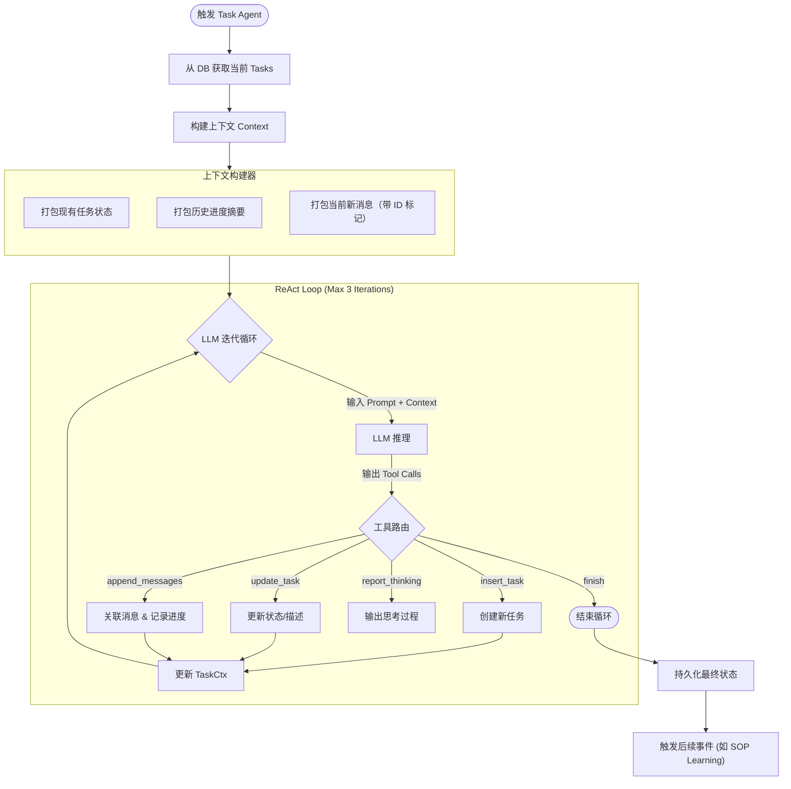

Task Agent 是 Acontext 核心引擎中的**状态机（State Machine）**。它不仅仅是一个简单的"待办事项列表"，而是一个运行在后台的智能观察者，负责将非结构化的自然语言对话（Unstructured Dialogue）实时转化为结构化的任务数据（Structured Task Data）。

本文档将深入源码层级（`src/server/core/acontext_core/llm/agent/task.py`），解析其工作原理。

## 1. 流程架构与执行逻辑

Task Agent 的执行不是线性的，而是一个基于 **ReAct (Reasoning + Acting)** 模式的循环决策过程。

### 1.1 核心执行流 (Execution Flow)

当消息缓冲区触发（Buffer Full 或 TTL 超时）时，`task_agent_curd` 函数被调用。以下是其内部执行逻辑的可视化：



### 1.2 决策逻辑 (Decision Logic)

Task Agent 的 System Prompt (`src/server/core/acontext_core/llm/prompt/task.py`) 定义了严格的决策树：

1.  **规划识别 (Planning Detection)**:
    *   如果消息包含 "我的计划是..."、"第一步...第二步..."，则识别为规划阶段。
    *   **Action**: 调用 `insert_task` 将规划转化为 `pending` 状态的任务列表。
    *   **Action**: 调用 `append_messages_to_planning_section` 标记规划消息。

2.  **执行追踪 (Execution Tracking)**:
    *   如果消息是工具调用（Tool Call）或执行结果，则属于任务执行。
    *   **Action**: 调用 `append_messages_to_task`。
    *   **关键逻辑**: 必须生成第一人称的进度摘要（"我访问了 GitHub..."），而不是简单引用消息。

3.  **状态流转 (State Transition)**:
    *   `pending` -> `running`: 检测到开始执行的信号。
    *   `running` -> `success`: 检测到明确的完成信号或开始执行下一个任务。
    *   `running` -> `failed`: 检测到错误且未自动修复，或用户明确中止。

---

## 2. 数据抽取机制：从对话到元数据

Task Agent 的核心能力在于**语义解析**与**元数据提取**。它如何理解 "用户想要什么" 以及 "现在做到了哪里"？

### 2.1 上下文构建 (Input Construction)

在调用 LLM 之前，系统会通过 `pack_` 系列函数构建高密度的上下文：

*   **Task Section (`pack_task_section`)**: 序列化当前所有任务及其状态。
*   **Progress Section (`pack_previous_progress_section`)**: 倒序提取最近 N 条进度记录，帮助 LLM 理解短期历史。
*   **Message Section (`pack_current_message_with_ids`)**: **这是最关键的一步**。每条消息被包裹在 XML 标签中并分配 ID：
    ```xml
    <message id=0> User: 帮我查下天气 </message>
    <message id=1> Assistant: 正在查询... </message>
    ```
    这使得 LLM 可以通过 ID 精确指代某条消息（Grounding）。

### 2.2 提取策略 (Extraction Strategy)

LLM 通过 Tool Arguments 输出结构化数据。以下是关键字段的提取逻辑：

*   **`task_description`**: 从规划类对话中提取，要求 MECE（相互独立，完全穷尽）。
*   **`progresses`**: 并非原文摘录，而是**事实性重述 (Fact-based Rewrite)**。
    *   *原文*: "API 返回了 200，内容是一堆 JSON..."
    *   *提取*: "成功调用天气 API，获取到当前气温为 25 度。"
*   **`user_preferences`**: 捕捉约束条件。
    *   *原文*: "别用那个旧的库，用 requests。"
    *   *提取*: "用户要求使用 requests 库而不是旧库。"

---

## 3. 数据流向与价值：Task Data Schema

生成的 `Task Data` 是 Acontext 生态系统中的通用货币。

### 3.1 Schema 定义

基于 `src/server/core/acontext_core/schema/session/task.py`：

```python
class TaskSchema(BaseModel):
    id: UUID                  # 唯一标识
    session_id: UUID          # 所属会话
    order: int                # 执行顺序 (1, 2, 3...)
    status: TaskStatus        # pending | running | success | failed
    raw_message_ids: List[UUID] # 证据链：哪些消息属于这个任务
    
    data: TaskData
        task_description: str       # 任务目标
        progresses: List[str]       # 逐步的执行摘要
        user_preferences: List[str] # 在此任务中收集到的用户偏好
```

### 3.2 下游消费场景

这些结构化数据被用于以下核心环节：

| 消费环节 | 数据用途 | 价值 |
| :--- | :--- | :--- |
| **SOP 提炼 (Skill Learning)** | 消费 `success` 状态的任务及其 `raw_message_ids`。 | **自动化编程**：系统通过回溯 `raw_message_ids` 找到具体的 Tool Call 序列，将其抽象为可复用的 SOP 技能。 |
| **长期记忆 (Long-term Memory)** | 消费 `user_preferences`。 | **个性化**：偏好数据会被索引，当 Agent 下次遇到类似任务时，自动注入这些约束。 |
| **上下文恢复 (Context Recovery)** | 消费 `task_description` + `progresses`。 | **Token 节省**：当对话过长时，系统可以丢弃原始消息，仅保留 Task List 作为"压缩后的记忆"，大幅降低 Token 消耗。 |
| **可观测性 (Observability)** | 消费全量 Task Data。 | **监控**：Dashboard 展示任务瀑布流，帮助开发者分析 Agent 的执行路径和瓶颈。 |

---

## 4. 具体示例：Input/Output 转换

让我们通过一个真实的案例，展示 Task Agent 如何将一段非结构化对话转化为结构化对象。

### 4.1 输入：非结构化对话 (Raw Context)

```text
## Current Message with IDs:
<message id=0> User: 我需要分析一下 Acontext 的 GitHub Star 增长趋势。 </message>
<message id=1> Assistant: 好的，我将分两步进行：
1. 调用 GitHub API 获取 Star 历史数据。
2. 使用 Matplotlib 绘制趋势图。 </message>
<message id=2> User: 记得图表要用深色主题，我习惯看深色的。 </message>
<message id=3> Assistant: 没问题，我会设置深色主题。正在获取数据... </message>
<message id=4> Tool(get_stars): {"repo": "memodb-io/acontext"} -> 200 OK, data=[...] </message>
```

### 4.2 处理：Agent 思考与工具调用 (Reasoning & Acting)

**Iteration 1 (思考与规划):**
*   **Thinking**: 用户提出了需求，Assistant 给出了规划。这涉及到新任务的创建。同时用户提出了偏好。
*   **Tool Call**: `insert_task(order=1, description="调用 GitHub API 获取 Star 历史数据")`
*   **Tool Call**: `insert_task(order=2, description="使用 Matplotlib 绘制趋势图")`
*   **Tool Call**: `append_messages_to_planning_section(message_ids=[0, 1])`

**Iteration 2 (执行与偏好):**
*   **Thinking**: 任务 1 已经开始执行（Tool Call 发生）。用户提出了关于图表的偏好，这应该关联到任务 2（绘图任务）。
*   **Tool Call**: `update_task(order=1, status="running")`
*   **Tool Call**: `append_messages_to_task(order=1, message_ids=[3, 4], progress="开始获取 Star 数据，API 调用成功返回数据。")`
*   **Tool Call**: `append_messages_to_task(order=2, message_ids=[2], user_preference="用户要求图表使用深色主题")`

### 4.3 输出：结构化 Task 对象 (Structured Data)

最终存入数据库的 JSON 结构：

```json
[
  {
    "order": 1,
    "status": "running",
    "data": {
      "task_description": "调用 GitHub API 获取 Star 历史数据",
      "progresses": [
        "开始获取 Star 数据，API 调用成功返回数据。"
      ],
      "user_preferences": []
    },
    "raw_message_ids": ["msg-uuid-3", "msg-uuid-4"]
  },
  {
    "order": 2,
    "status": "pending",
    "data": {
      "task_description": "使用 Matplotlib 绘制趋势图",
      "progresses": [],
      "user_preferences": [
        "用户要求图表使用深色主题"
      ]
    },
    "raw_message_ids": ["msg-uuid-2"]
  }
]
```

通过这种转换，原本散落在对话中的意图、约束和状态，变成了计算机可理解、可索引、可复用的精确数据。
